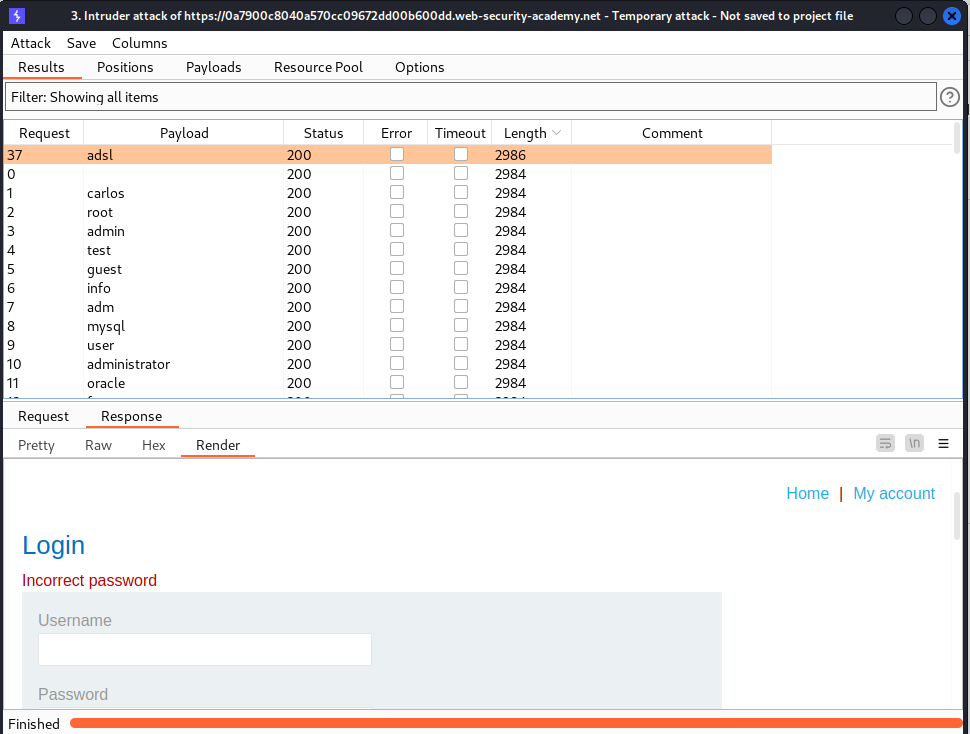
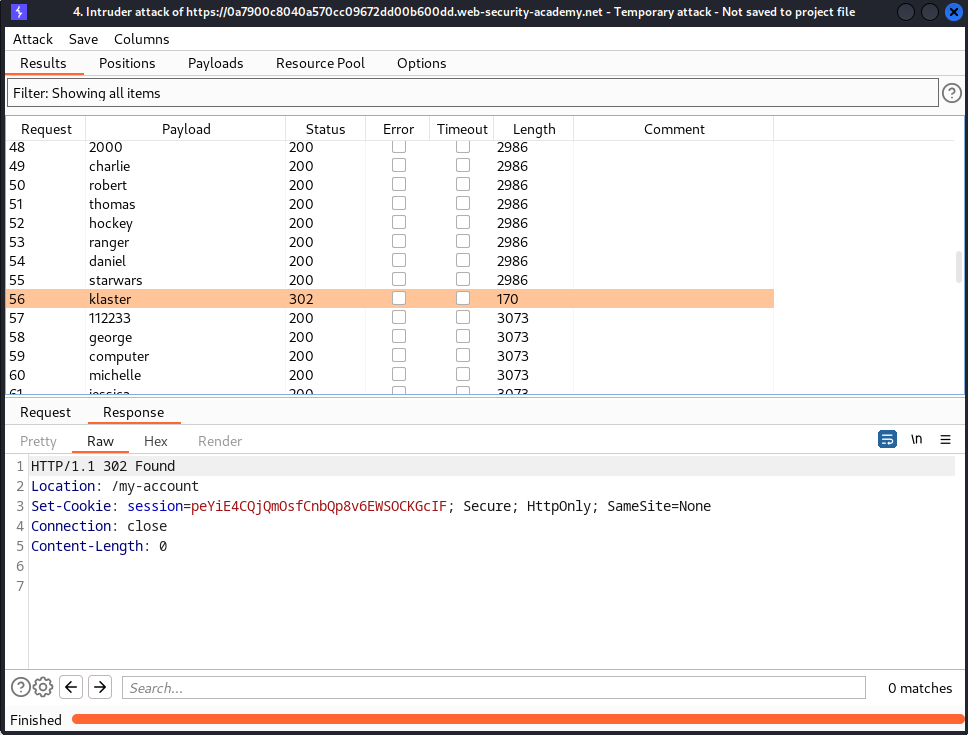

# [Lab: Username enumeration via different responses](https://portswigger.net/web-security/authentication/password-based/lab-username-enumeration-via-different-responses)

## Lab

This lab is vulnerable to username enumeration and password brute-force attacks. It has an account with a predictable username and password, which can be found in the following wordlists:

- [Candidate usernames](https://portswigger.net/web-security/authentication/auth-lab-usernames)
- [Candidate passwords](https://portswigger.net/web-security/authentication/auth-lab-passwords)

To solve the lab, enumerate a valid username, brute-force this user's password, then access their account page.

## Characteristics

existed username enumeration based on response

## Solutions

enumerate username using burp's intruder:

- mode: sniper
- positions:

  ```http
  POST /login HTTP/1.1

  username=§test§&password=test
  ```

- payloads: [Candidate usernames](https://portswigger.net/web-security/authentication/auth-lab-usernames)

- based on the response, we can enumerate exist users:

  - `invalid username` => username doesn't exist
  - `incorrect password` => username exists

  

find password using burp's intruder:

- mode: sniper
- positions:

  ```http
  POST /login HTTP/1.1

  username=existed_username&password=§test§
  ```

- payloads: [Candidate passwords](https://portswigger.net/web-security/authentication/auth-lab-passwords)
- based on the response, we can find the password
  
