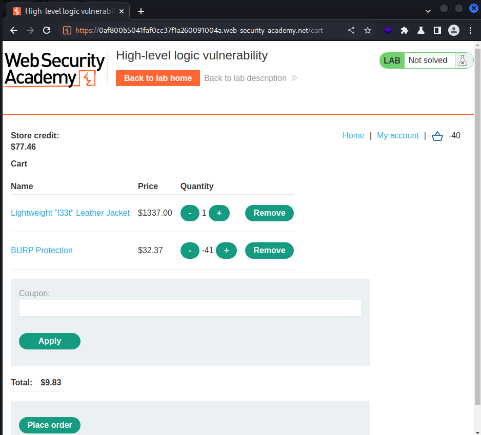

# [Lab: High-level logic vulnerability](https://portswigger.net/web-security/logic-flaws/examples/lab-logic-flaws-high-level)

## Lab

This lab doesn't adequately validate user input. You can exploit a logic flaw in its purchasing workflow to buy items for an unintended price. To solve the lab, buy a "Lightweight l33t leather jacket".

You can log in to your own account using the following credentials:  `wiener:peter`

## Analysis

add to cart request:

```http
POST /cart HTTP/1.1

productId=1&redir=PRODUCT&quantity=-1
```

- total price: -1337
- order: `Cart total price cannot be less than zero`

## Solutions

- add 1 target product to cart: 1337
- add a negative number of other products to the cart to make `0 < total price < 100`
  
- order => solved
