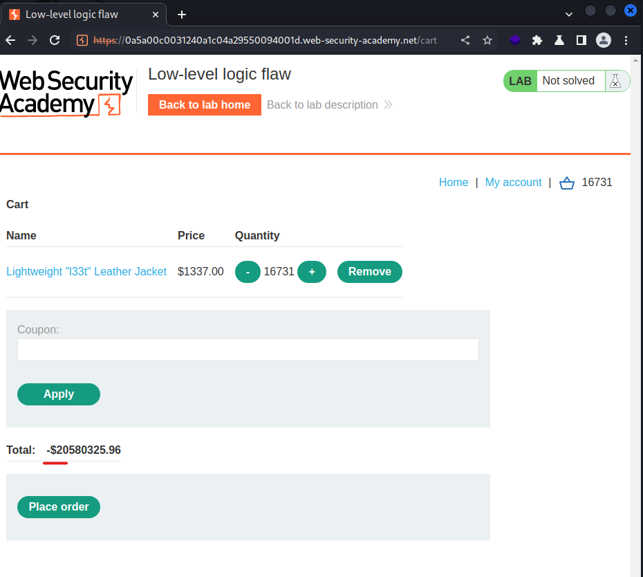
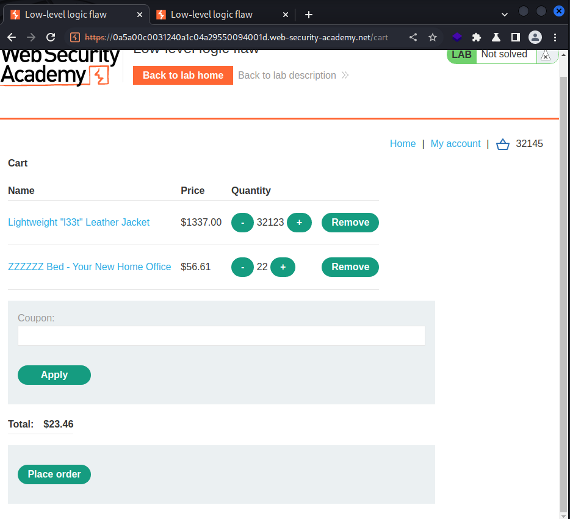

# [Lab: Low-level logic flaw](https://portswigger.net/web-security/logic-flaws/examples/lab-logic-flaws-low-level)

## Lab

This lab doesn't adequately validate user input. You can exploit a logic flaw in its purchasing workflow to buy items for an unintended price. To solve the lab, buy a "Lightweight l33t leather jacket".

You can log in to your own account using the following credentials:  `wiener:peter`

## Characteristic

integer overflow

## Solutions

