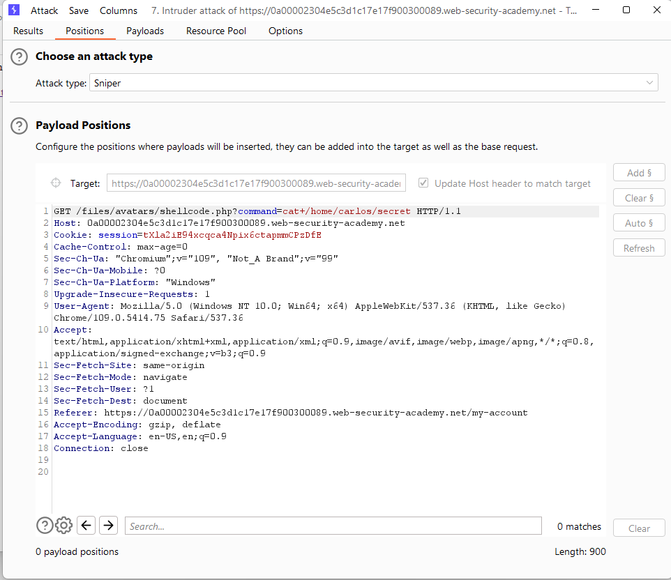
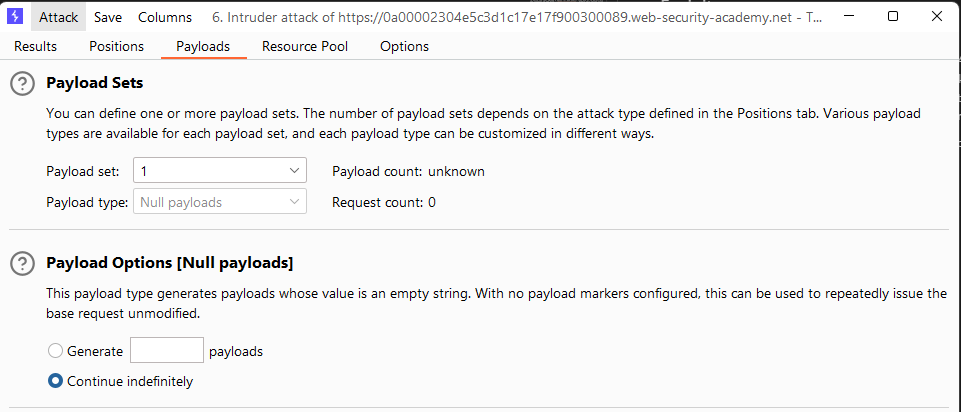
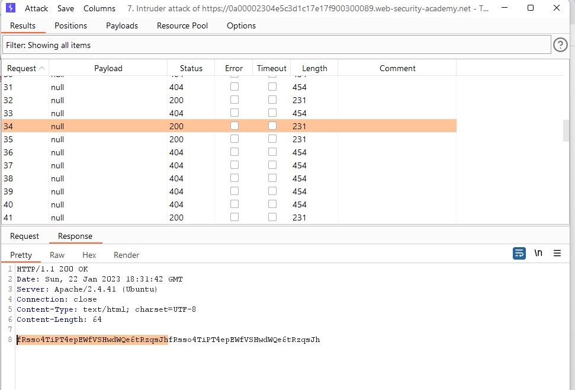

# [Lab: Web shell upload via race condition](https://portswigger.net/web-security/file-upload/lab-file-upload-web-shell-upload-via-race-condition)

This lab contains a vulnerable image upload function. Although it performs robust validation on any files that are uploaded, it is possible to bypass this validation entirely by exploiting a race condition in the way it processes them.

To solve the lab, upload a basic PHP web shell, then use it to exfiltrate the contents of the file  `/home/carlos/secret`. Submit this secret using the button provided in the lab banner.

You can log in to your own account using the following credentials:  `wiener:peter`

**Hint:**
The vulnerable code that introduces this race condition is as follows:

```php
<?php
$target_dir = "avatars/";
$target_file = $target_dir . $_FILES["avatar"]["name"];

// temporary move
move_uploaded_file($_FILES["avatar"]["tmp_name"], $target_file);

if (checkViruses($target_file) && checkFileType($target_file)) {
    echo "The file ". htmlspecialchars( $target_file). " has been uploaded.";
} else {
    unlink($target_file);
    echo "Sorry, there was an error uploading your file.";
    http_response_code(403);
}

function checkViruses($fileName) {
    // checking for viruses
    ...
}

function checkFileType($fileName) {
    $imageFileType = strtolower(pathinfo($fileName,PATHINFO_EXTENSION));
    if($imageFileType != "jpg" && $imageFileType != "png") {
        echo "Sorry, only JPG & PNG files are allowed\n";
        return false;
    } else {
        return true;
    }
}
?>
```

## Analysis

The file still exists on the server for a very short time before being deleted.

## Idea

use burp's intruder repeatedly send request to the expected shellcode, then upload shellcode.

## Exploit

exploit:

- burp's intruder setup:


- start intruder attack
- upload shellcode
- pause intruder attack and check, there are some requests with response status code 200:

