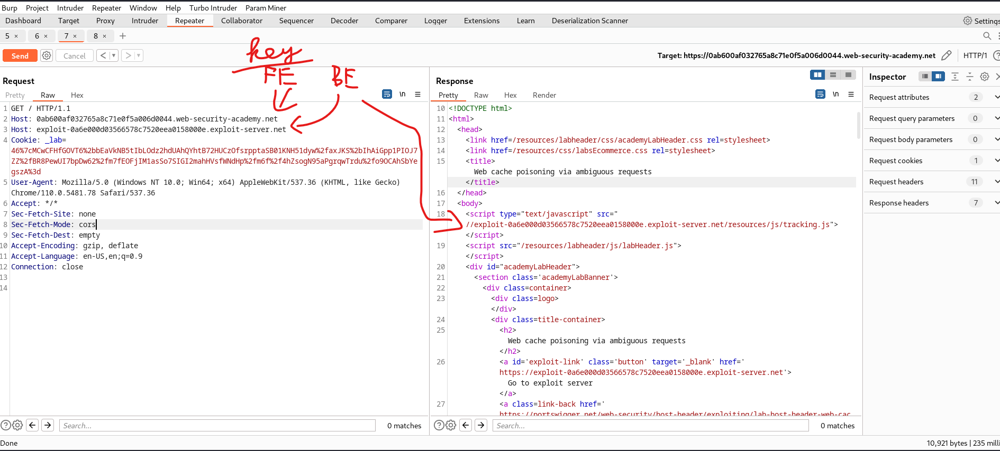

# [Lab: Web cache poisoning via ambiguous requests](https://portswigger.net/web-security/host-header/exploiting/lab-host-header-web-cache-poisoning-via-ambiguous-requests)

## Lab

This lab is vulnerable to web cache poisoning due to discrepancies in how the cache and the back-end application handle ambiguous requests. An unsuspecting user regularly visits the site's home page.

To solve the lab, poison the cache so the home page executes `alert(document.cookie)` in the victim's browser.

## Detect

Inject duplicate Host headers:

## Analysis
