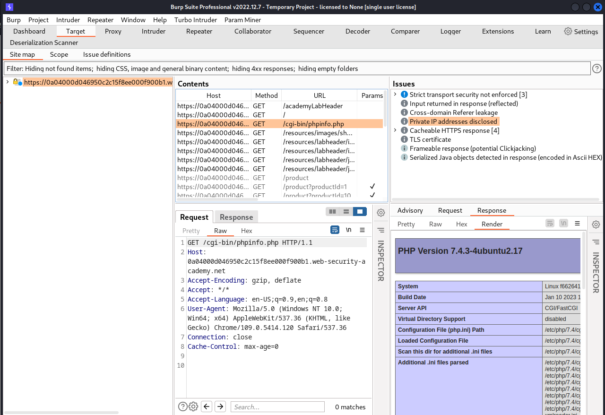

# [Lab: Information disclosure on debug page](https://portswigger.net/web-security/information-disclosure/exploiting/lab-infoleak-on-debug-page)

## Lab

This lab contains a debug page that discloses sensitive information about the application. To solve the lab, obtain and submit the `SECRET_KEY` environment variable.

## Analysis

burpsuite scan:

## Solutions

submit found `SECRET_KEY` at `phpinfo.php` page.
