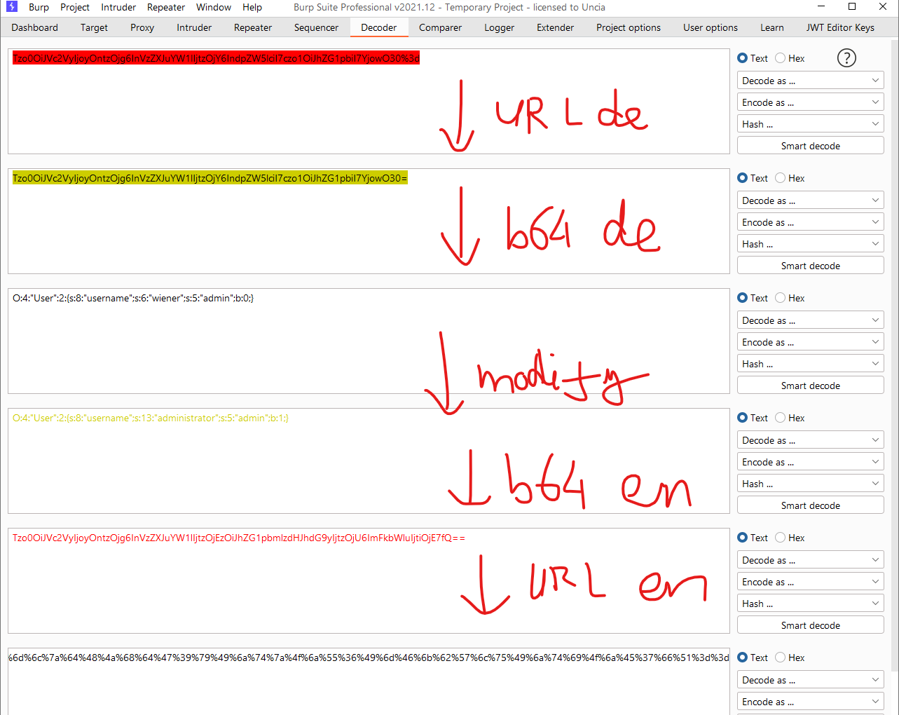

# [Lab: Modifying serialized objects](https://portswigger.net/web-security/deserialization/exploiting/lab-deserialization-modifying-serialized-objects)

## Lab

This lab uses a serialization-based session mechanism and is vulnerable to privilege escalation as a result. To solve the lab, edit the serialized object in the session cookie to exploit this vulnerability and gain administrative privileges. Then, delete Carlos's account.

You can log in to your own account using the following credentials: `wiener:peter`

## Analysis

detected serialized php object at session cookie.

## Solutions

modify object:

