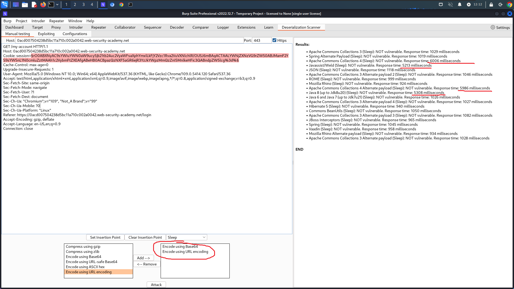
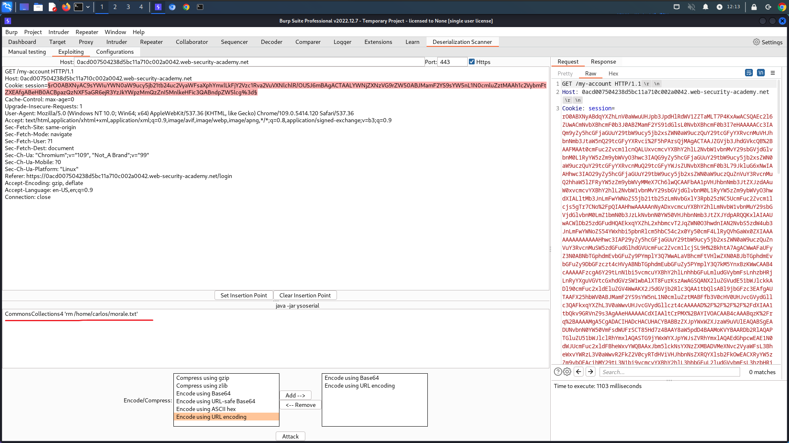

# [Lab: Exploiting Java deserialization with Apache Commons](https://portswigger.net/web-security/deserialization/exploiting/lab-deserialization-exploiting-java-deserialization-with-apache-commons)

## Lab

This lab uses a serialization-based session mechanism and loads the Apache Commons Collections library. Although you don't have source code access, you can still exploit this lab using pre-built gadget chains.

To solve the lab, use a third-party tool to generate a malicious serialized object containing a remote code execution payload. Then, pass this object into the website to delete the `morale.txt` file from Carlos's home directory.

You can log in to your own account using the following credentials: `wiener:peter`

## Analysis

after logging into wiener account, burpsuite detected: `parameter session appears to contain a serialized Java object`

use burp's extension `java deserialized scanner` with `ysoserial` to scan:



even though the scanner says `NOT vulnerable`, some gadget chains still have a long response time:

- Apache CommonsCollections4
- Java 8
- Javassist/Weld

So let's try them one by one

## Solutions

```bash
java -jar ysoserial-all.jar CommonsCollections4 'rm /home/carlos/morale.txt' | base64 -w 0
```

put the result into session and send to server.

 or use burpsuite:


