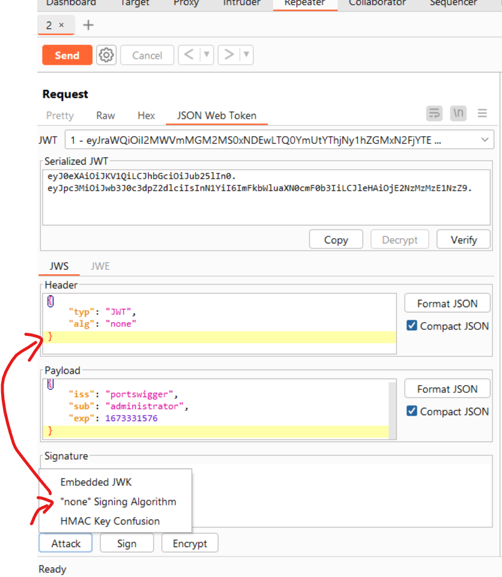

# [Lab: JWT authentication bypass via flawed signature verification](https://portswigger.net/web-security/jwt/lab-jwt-authentication-bypass-via-flawed-signature-verification)

## Lab

This lab uses a JWT-based mechanism for handling sessions. The server is insecurely configured to accept unsigned JWTs.

To solve the lab, modify your session token to gain access to the admin panel at  `/admin`, then delete the user  `carlos`.

You can log in to your own account using the following credentials:  `wiener:peter`

## Solution

- attack with `"none" Signing algorithm
- change "sub" to "administrator"

