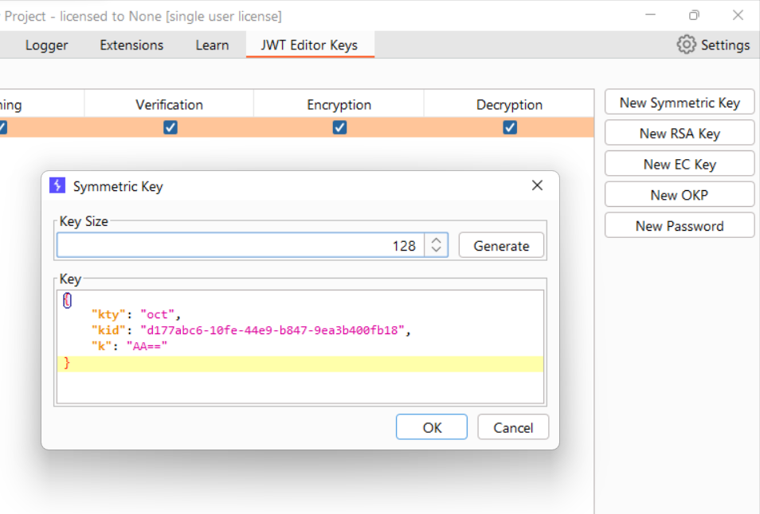
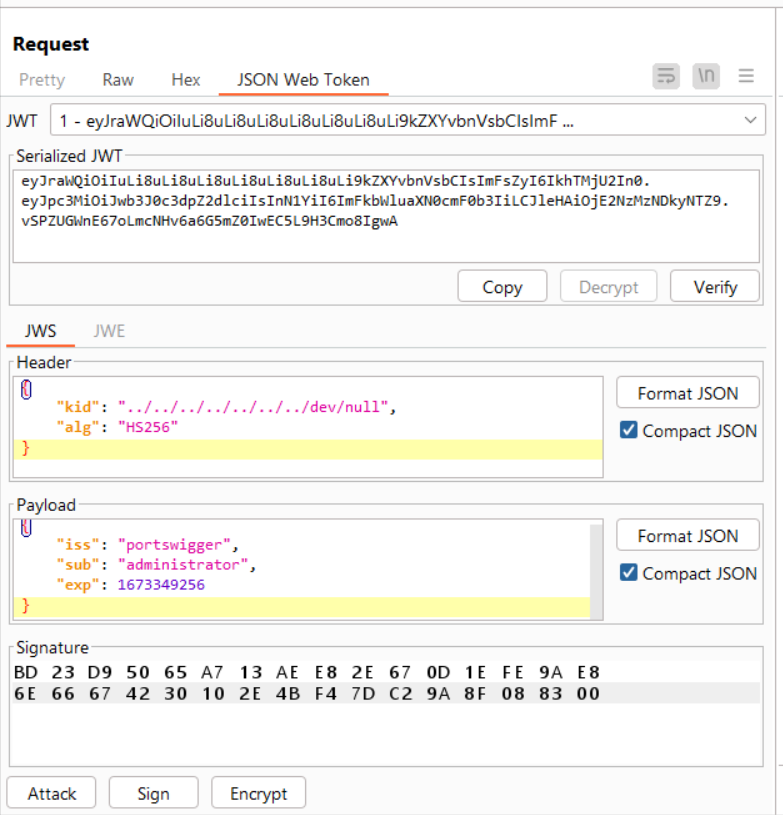

# [Lab: JWT authentication bypass via kid header path traversal](https://portswigger.net/web-security/jwt/lab-jwt-authentication-bypass-via-kid-header-path-traversal)

## Lab

This lab uses a JWT-based mechanism for handling sessions. In order to verify the signature, the server uses the  `kid`  parameter in  [JWT](https://portswigger.net/web-security/jwt)  header to fetch the relevant key from its filesystem.

To solve the lab, forge a JWT that gives you access to the admin panel at  `/admin`, then delete the user  `carlos`.

You can log in to your own account using the following credentials:  `wiener:peter`

## Solutions

generate symmetric key with `"k": base64-encode(\x00)`:

- change body "sub": "administrator"
- sign with newly created key:

try with different "kid":

- "../../../../dev/null"
- "../../../../../dev/null"
...

on successful login as admin, delete the carlos account.
