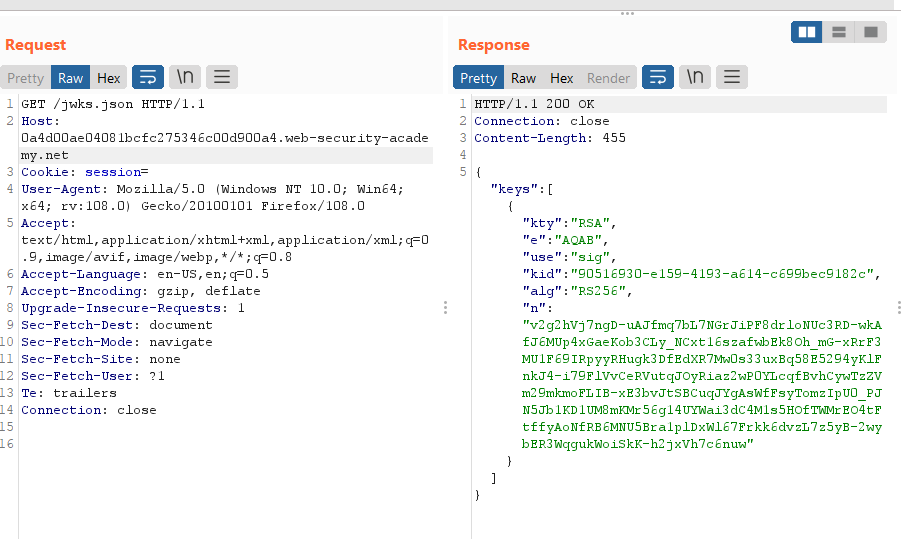
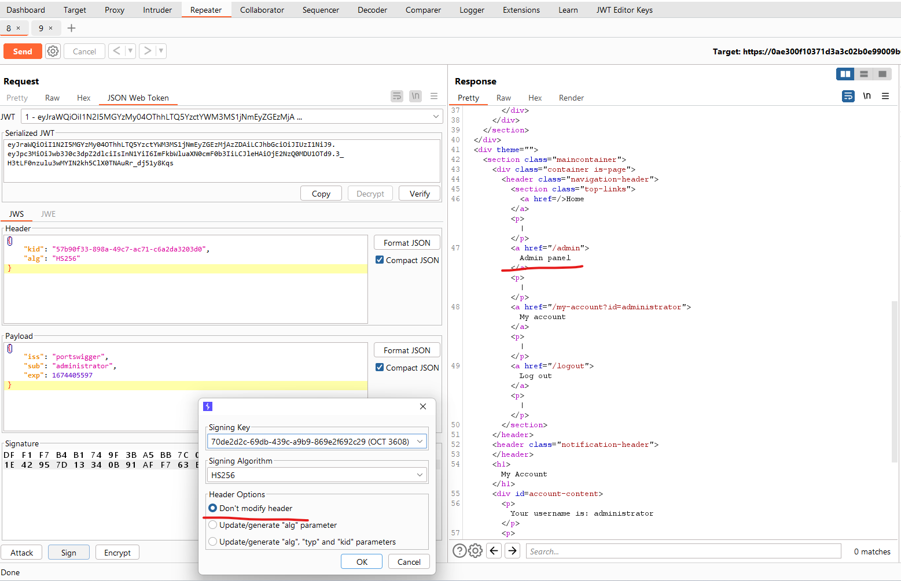

# [Lab: JWT authentication bypass via algorithm confusion](https://portswigger.net/web-security/jwt/algorithm-confusion/lab-jwt-authentication-bypass-via-algorithm-confusion)

## Lab

This lab uses a JWT-based mechanism for handling sessions. It uses a robust RSA key pair to sign and verify tokens. However, due to implementation flaws, this mechanism is vulnerable to algorithm confusion attacks.

To solve the lab, first obtain the server's public key. This is exposed via a standard endpoint. Use this key to sign a modified session token that gives you access to the admin panel at `/admin`, then delete the user `carlos`.

You can log in to your own account using the following credentials: `wiener:peter`

## Solution

Step 1 - Obtain the server's public key via standard endpoint `/jwks.json` or `/.well-known/jwks.json`:

Step 2 - Convert the public key to a suitable format:

- generate new rsa key, paste the JWK obtained from server, save.
- select copy public key as pem
- then base64 encode
- generate new symmetric key, replace "k" with base64 encoded value

Step 3 - sign

- edit jwt's body
- change "alg" from RS256 to HS256
- sign with symmetric key

- send

result:

delete carlos's account => lab solved.
