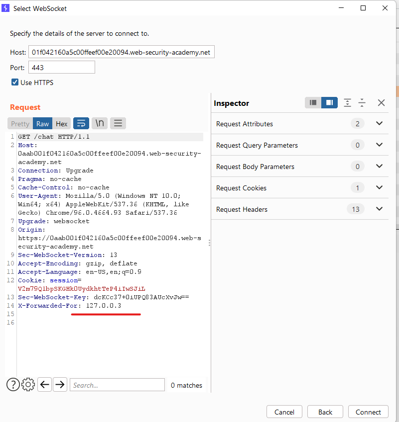

# [Lab: Manipulating the WebSocket handshake to exploit vulnerabilities](https://portswigger.net/web-security/websockets/lab-manipulating-handshake-to-exploit-vulnerabilities)

## Lab

This online shop has a live chat feature implemented using WebSockets.

It has an aggressive but flawed XSS filter.

To solve the lab, use a WebSocket message to trigger an `alert()` popup in the support agent's browser.

## Characteristic

blocked after trying xss: bypass by X-Forwarded-For http header

filtered by blacklist: Obfuscating using case variation (`Onerror`) + js unusual syntax (alert\`1\`)

## Analysis

bypass : changing X-Forwarded-For to a different address every time we are blocked by server.



to server:

  ```json
  {"message":"<script>"}
  ```

- response:

  ```json
  {"error":"Attack detected: JavaScript"}
  ```

to server:

  ```json
  {"message":""}
  ```

- response:

  ```json
  {"error":"Attack detected: event"}
  ```

## Solutions

to server:

  ```json
  {"message":""}
  ```
